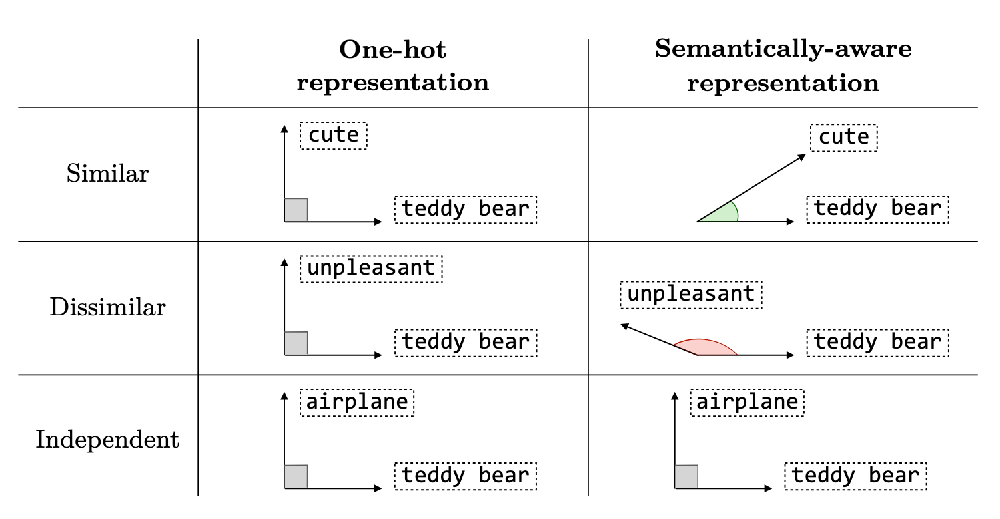
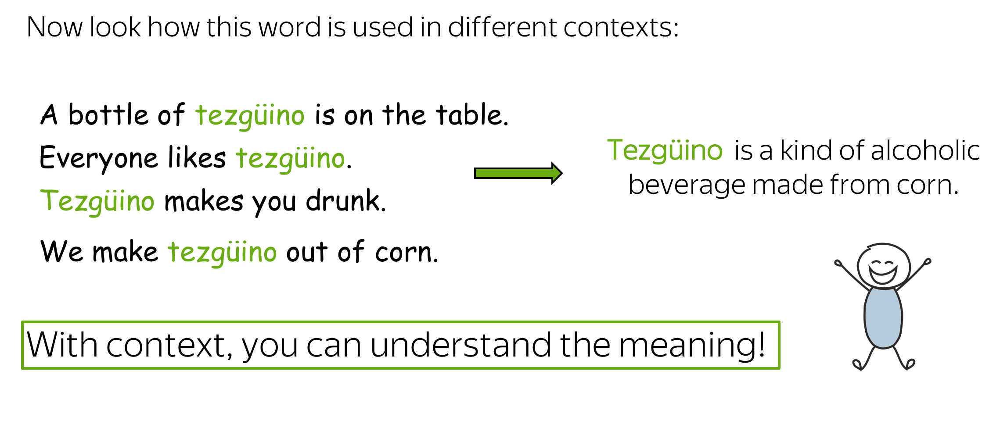
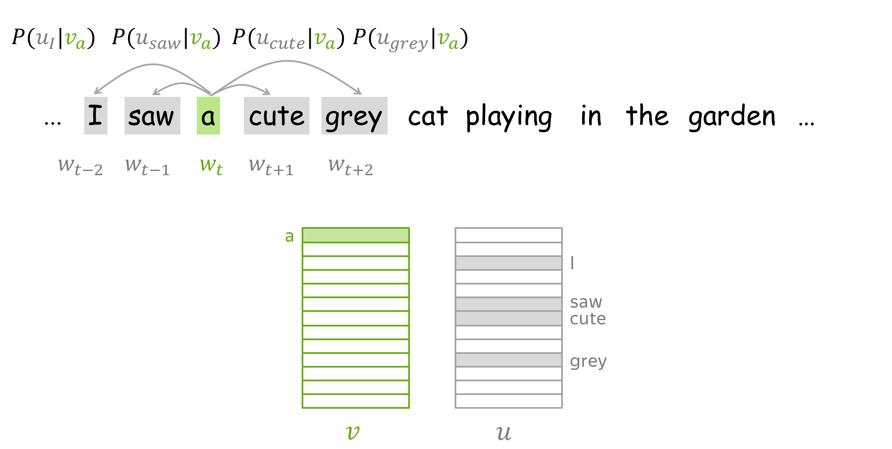

---
# You can also start simply with 'default'
theme: seriph
# random image from a curated Unsplash collection by Anthony
# like them? see https://unsplash.com/collections/94734566/slidev
background: https://cover.sli.dev
# some information about your slides (markdown enabled)
title: Welcome to Slidev
info: |
  ## Slidev Starter Template
  Presentation slides for developers.

  Learn more at [Sli.dev](https://sli.dev)
# apply unocss classes to the current slide
class: text-center
# https://sli.dev/features/drawing
drawings:
  persist: false
# slide transition: https://sli.dev/guide/animations.html#slide-transitions
transition: slide-left
# enable MDC Syntax: https://sli.dev/features/mdc
mdc: true

fonts:
  # basically the text
  sans: Source Han Sans 
  # use with `font-serif` css class from UnoCSS
  serif: Source Han Serif
  bold: Source Han Sans Bold
---

 ### <span style="color:grey;">心研社学工作坊 </span>

## 自然语言处理在社会科学中的应用

日本东北大学 计算人文社会学

吕泽宇

<div class="abs-br m-6 text-xl">
  <a href="https://github.com/slidevjs/slidev" target="_blank" class="slidev-icon-btn">
    <carbon:logo-github />
  </a>
</div>

<!--
The last comment block of each slide will be treated as slide notes. It will be visible and editable in Presenter Mode along with the slide. [Read more in the docs](https://sli.dev/guide/syntax.html#notes)
-->

---
transition: fade-out
---

# 自我介绍

- **所属**: 日本东北大学 文学研究科 [计算人文社会学研究室](https://www.sal.tohoku.ac.jp/jp/research/researcher/profile/---id-190.html) 副教授
- **主要经历**: 博士期间隶属于[日本学术振兴会特别研究员DC2](https://www.jsps.go.jp/j-pd/), [東北大学WISE Program for AI Electronics](https://www.aie.tohoku.ac.jp/), [東北大学Division for Interdisciplinary Advanced Research and Education](http://www.iiare.tohoku.ac.jp/); 在担任[东京大学社会科学研究所](https://jww.iss.u-tokyo.ac.jp/)研究员之后加入目前所属单位.

- **主要研究方向**
    - 基于大规模移动数据关于社会空间隔离(Social spatial segregation)的实证分析和社会模拟
    - <v-click><span class="normal highlight">关于网络空间上意见形成的实证分析和社会模拟</span></v-click>
    - <v-after><span class="normal highlight">基于文本的文化演化分析</span></v-after>

<p v-click class="absolute bottom-45 left-150 transform" style="color: #146b8c;">
  自然语言处理在社会科学中的应用
</p>

<arrow
    v-after
    x1="480"
    y1="345"
    x2="580"
    y2="345"
    color="#146b8c"
    width="3"
    arrowSize="1" />

<style>
.normal {
  transition: color 0.5s ease-in-out;
}
.highlight {
  color: black !important;
  font-weight: bold;
  text-decoration: underline;
}
</style>

---

# 内容构成

<div grid="~ cols-2 gap-4">
<div>

## 上午 (9:00~12:00)

- 课程内容介绍
- 自然语言处理的基础
- 词向量 (Word Embeddding)
    - 词向量的概念和基本原理
    - Word2Vec
    - 通过Gensim训练和使用词向量
- 词向量在社会科学中的应用
    - [Garg, Schiebinger, Jurafsky, & Zou (2018)](https://www.pnas.org/doi/10.1073/pnas.1720347115)
    - [Kozlowski, Taddy, & Evans (2019)](https://journals.sagepub.com/doi/full/10.1177/0003122419877135)
    - 研究实践
- Transformer的基本原理

</div>

<div>

## 下午 (14:00~17:00)

- 基于Transformer的语言模型在文本分析中的应用
    - BERTopic
    - 文本分类
- 大语言模型(LLMs)基础
    - LLMs的基本原理
    - In-context Learning
    - Post-train
- LLMs Agent
    - LLMs Agent的基本原理
    - LLMs Agent在社会科学中的应用与展望
- Q&A
</div>
</div>

<p v-click style="color: #146b8c; font-size: 1.5em; text-align: center;">
  实际课程可能会根据进度进行部分调整
</p>

---
transition: fade-out
---

# 课程说明

- 课程资料可以通过以下链接访问查看
   - 上午部分
   - 下午部分

- 课程中使用的代码在Github上公开
   - 通过资料中的链接可以直接在Google Colab上运行
   - 在本地或者其它云端服务器使用Jupyter Notebook运行(可能需要额外的环境配置)

- 在大多数情况下,本次课程会尽量避免数学和模型内部的详细说明。相关内容请额外参考其它资料。 

---
transition: slide-up
level: 1
---

# 自然语言处理的发展历史

- 自然语言处理（NLP: Natural Language Processing）是一系列让计算机处理人类日常使用的自然语言的技术
    - 对于计算机而言，处理像人类语言这样缺乏明确规则的非结构化数据往往是十分困难的任务

- 在自然语言技术发展早期阶段的主流方法是诸如隐马尔可夫模型（HMM）、线性支持向量机（SVM）以及逻辑回归（logistic regression）等统计机器学习（statistical machine learning）的方法。


<div style="display: flex; justify-content: center;">
  
</div>


---
transition: slide-up
level: 2
---

# 自然语言处理的发展历史

- 从2010年代开始, 深度学习的方法开始被广泛地应用于自然语言处理之中

- 2018年，Google发布了名为BERT的模型，确立了「预训练ー微调」的开发范式。
- 生成式AI的持续发展(2019~)

<div style="position: relative; display: flex; justify-content: center;">
  <!-- 图片 -->
  
  
  <!-- 没有填充的矩形 -->
  <svg width="800" height="400" style="position: absolute; top: 0; left: 0;">
    <rect x="400" y="80" width="300" height="120" stroke="#146b8c" fill="none" stroke-width="3" />
  </svg>
</div>

---
transition: fade-out
level: 1
---

# 深度学习的基本原理

神经网络的基本构件: 感知器

<div grid="~ cols-2 gap-4">
<div>

感知器是一种接受多个输入并通过加权求和来输出一个「信号」的算法

$$
y= w_1 \cdot x_1+ w_2 \cdot x_2+ b
$$

- 每个输入$x_i$（例如$x_1$和$x_2$）都会有一个对应的权重$w_i$，这些权重控制了每个输入在最终输出中的重要性
- $b$是Bias，它用来调整输出的值，以便模型更好地拟合数据。
</div>

<div>

<div style="display: flex; justify-content: center;">
  
</div>
</div>
</div>

<p v-click style="color: #146b8c; font-size: 1.5em; text-align: center;">
  一个最基础的感知器可以描述输入变量和输出变量之间的 「线性关系」
</p>

---
transition: slide-up
level: 2
---

# 深度学习的基本原理

激活函数

<div grid="~ cols-2 gap-4">
<div>

对于基本的感知器的输出结果进行额外的计算

$$
a= w_1 \cdot x_1+ w_2 \cdot x_2+ b
$$

$$
y= h(a)
$$

- $h(\cdot)$代表激活函数

- 例: Step Function

$$
y   = \begin{cases}
          0 \quad (w_1 x_1 + w_2 x_2 + b \leq 0) \\
          1 \quad (w_1 x_1 + w_2 x_2 + b > 0)
      \end{cases}
$$

</div>

<div>

<div style="display: flex; justify-content: center;">
  
</div>
</div>
</div>

<p v-click style="color: #146b8c; font-size: 1.5em; text-align: center;">
  激活函数可以导入非线性特征, 增强感知器的表现力
</p>

---
transition: slide-up
level: 2
---

# 深度学习的基本原理

激活函数的作用

<div style="display: flex; justify-content: center;">
  
</div>

<p v-click style="color: #146b8c; font-size: 1.5em; text-align: center;">
  通过套用不同的激活函数,感知器可以用于不同类型的问题
</p>

---
transition: slide-up
level: 2
---

# 深度学习的基本原理

神经网络

<div grid="~ cols-2 gap-4">
<div>

- 神经网络:多个感知器的并联和堆叠所实现的多输入、多输出的网络层结构

- 神经网络训练的目的: 根据数据调整每个感知器的内部参数,使得神经网络内部的感知器能综合处理输入的特征值,对于输入数据进行合适的处理,最终得到理想的输出
    - 感知器的内部参数: 权重$w$和Bias $b$
    - 根据数据调整: 训练数据提供“正确”的输入与输出的情报。神经网络会调整内部参数,从而使网络的输出逐渐接近“正确”的输出
</div>

<div>

<div style="display: flex; justify-content: center;">
  
</div>
</div>
</div>


---
transition: slide-up
level: 2
---

# 深度学习的基本原理

神经网络的参数优化

<div style="display: flex; justify-content: center;">
  
</div>

<p v-click style="color: #146b8c; font-size: 1.5em; text-align: center;">
  神经网络参数的核心算法: 反向传播法
</p>


---
transition: slide-up
level: 2
---

# 深度学习的基本原理

深度学习的核心功能

- 神经网络的核心功能是将任意向量形式的输入转换为任意向量形式的输出
    - 神经网络接收的输入通常是一个向量(或矩阵)形式的数据，通过网络的多层结构，网络逐渐将输入向量转换成输出

- 许多"任务"都可以被定义为一种“输入-输出”
    - 文本分类
        - 输入: 一段文本
        - 输出: 分类标签

- 神经网络对于多种任务的适应性
    - 将特定任务中对象以向量形式进行表示, (理论上)就可以应用于神经网络

---
transition: fade-out
level: 1
---

# 词向量(Word Embedding)

- 如何用向量(数值数组)来表现文本 ❓
    - 深度学习模型接收向量作为输入和输出
- 以将文本的更小单位（如词语）表示为向量作为出发点 → 词向量
    - 可以在后续处理中将每个词的向量表示组合成整个文本的表示


<div style="text-align: center;">

</div>

<div style="text-align: center;">

</div>

- 对于词向量的基本要求
   - 词与词向量之间的映射关系
   - 词向量捕捉和表达词语的语义信息

---
transition: slide-up
level: 2
---

# One-hot Encoding

使用One-hot Encoding表示文本

- 假设我们有以下英文句子："I like NLP and AI"
- 为文本中的每个独立词构建一个词汇表，并为每个词分配一个唯一的索引
- 每个词用一个长度等于词汇表大小的向量表示。该向量只有一个位置为 1（对应该词的索引），其余为 0

| 词语   | One-hot Encoding        |
|--------|------------------------|
| I      | [1, 0, 0, 0, 0]        |
| like   | [0, 1, 0, 0, 0]        |
| NLP    | [0, 0, 1, 0, 0]        |
| and    | [0, 0, 0, 1, 0]        |
| AI     | [0, 0, 0, 0, 1]        |

---
transition: slide-up
level: 2
---

# One-hot Encoding

One-hot Encoding的问题


<div grid="~ cols-[1fr_2fr] gap-4">
<div>

One-hot Encoding的问题

- 算法上的缺陷
    - 高维稀疏
    - 学习效率低
    - ...
- 无法反映语义关系
    - 向量之间的距离或夹角应反映词语间的语义相似程度或者联系
    - 词之间的语义关系可以通过向量运算表达
</div>

<div>


<div style="display: flex; justify-content: center;">
  
</div>
</div>
</div>

---
transition: fade-out
level: 1
---

# 词向量的语义表达

Semantically-aware Representation

<div style="display: flex; justify-content: center;">
  
</div>

---
transition: slide-up
level: 2
---

# Word2Vec

分布假说

> “You shall know a word by the company it keeps（你可以通过其周围的上下文单词来了解一个目标单词）”

<div style="display: flex; justify-content: center;">
  
</div>

---
transition: slide-up
level: 2
---

# 分布假说


> “You shall know a word by the company it keeps（你可以通过其周围的上下文单词来了解一个目标单词）”

<div style="display: flex; justify-content: center;">
  
</div>


---
transition: slide-up
level: 2
---

# 分布假说


> “You shall know a word by the company it keeps（你可以通过其周围的上下文单词来了解一个目标单词）”

<div style="display: flex; justify-content: center;">
  
</div>

---
transition: slide-up
level: 2
---

# 分布假说

> “You shall know a word by the company it keeps（你可以通过其周围的上下文单词来了解一个目标单词）”

<div style="display: flex; justify-content: center;">
  
</div>


---
transition: slide-up
level: 2
---

# Word2Vec的训练方法

单词窗口(Word window)

<div style="display: flex; justify-content: center;">
  
</div>

<div style="display: flex; justify-content: center;">
  
</div>


---
transition: slide-up
level: 2
---

# Word2Vec的训练方法(Skip-gram)

训练任务的构建

- 输入: 中心单词的向量
- 输出: 相应的上下文单词的向量

<div style="display: flex; justify-content: center;">
  
</div>

---
transition: slide-up
level: 2
---

# Word2Vec的训练方法(Skip-gram)

训练任务的构建

<div grid="~ cols-2 gap-4">
<div>


- 输入层是目标单词的one-hot向量(维度为$1\times |V|$)
    - 其中只有目标单词对应的位置索引被激活

- 经过目标单词嵌入矩阵$W_{|V|\times d}$将其投影为一个$1\times d$的嵌入向量
- 嵌入向量可以和上下文单词嵌入矩阵得到上下文单词的$1\times |V|$的概率向量
    - 每个元素代表词汇表中相应位置的单词在这里出现的概率
</div>

<div>

<div style="display: flex; justify-content: center;">
  
</div>
</div>
</div>

---
transition: slide-up
level: 2
---

# Word2Vec的训练方法(Skip-gram)

训练任务的构建


<div style="display: flex; justify-content: center;">
  
</div>

---
transition: slide-up
level: 2
---

# Word2Vec的训练方法(Skip-gram)

训练任务的构建


<div style="display: flex; justify-content: center;">
  
</div>

<p v-click style="color: #146b8c; font-size: 1.5em; text-align: center;">
  模型所需的训练数据可以给予语料库自动构建
</p>

---
transition: slide-up
level: 2
---
  
# Navigation

Hover on the bottom-left corner to see the navigation's controls panel, [learn more](https://sli.dev/guide/ui#navigation-bar)

## Keyboard Shortcuts

|                                                     |                             |
| --------------------------------------------------- | --------------------------- |
| <kbd>right</kbd> / <kbd>space</kbd>                 | next animation or slide     |
| <kbd>left</kbd>  / <kbd>shift</kbd><kbd>space</kbd> | previous animation or slide |
| <kbd>up</kbd>                                       | previous slide              |
| <kbd>down</kbd>                                     | next slide                  |

<!-- https://sli.dev/guide/animations.html#click-animation -->

<p v-after class="absolute bottom-23 left-45 opacity-30 transform -rotate-10">Here!</p>


---
layout: image-right
image: https://cover.sli.dev
---
  
# Code

Use code snippets and get the highlighting directly, and even types hover!

```ts {all|5|7|7-8|10|all} twoslash
// TwoSlash enables TypeScript hover information
// and errors in markdown code blocks
// More at https://shiki.style/packages/twoslash

import { computed, ref } from 'vue'

const count = ref(0)
const doubled = computed(() => count.value * 2)

doubled.value = 2
```

<arrow v-click="[4, 5]" x1="350" y1="310" x2="195" y2="334" color="#953" width="2" arrowSize="1" />

<!-- This allow you to embed external code blocks -->
<<< @/snippets/external.ts#snippet

<!-- Footer -->

[Learn more](https://sli.dev/features/line-highlighting)

<!-- Inline style -->
<style>
.footnotes-sep {
  @apply mt-5 opacity-10;
}
.footnotes {
  @apply text-sm opacity-75;
}
.footnote-backref {
  display: none;
}
</style>

<!--
Notes can also sync with clicks

[click] This will be highlighted after the first click

[click] Highlighted with `count = ref(0)`

[click:3] Last click (skip two clicks)
-->

---
level: 2
---

# Shiki Magic Move

Powered by [shiki-magic-move](https://shiki-magic-move.netlify.app/), Slidev supports animations across multiple code snippets.

Add multiple code blocks and wrap them with <code>````md magic-move</code> (four backticks) to enable the magic move. For example:

````md magic-move {lines: true}
```ts {*|2|*}
// step 1
const author = reactive({
  name: 'John Doe',
  books: [
    'Vue 2 - Advanced Guide',
    'Vue 3 - Basic Guide',
    'Vue 4 - The Mystery'
  ]
})
```

```ts {*|1-2|3-4|3-4,8}
// step 2
export default {
  data() {
    return {
      author: {
        name: 'John Doe',
        books: [
          'Vue 2 - Advanced Guide',
          'Vue 3 - Basic Guide',
          'Vue 4 - The Mystery'
        ]
      }
    }
  }
}
```

```ts
// step 3
export default {
  data: () => ({
    author: {
      name: 'John Doe',
      books: [
        'Vue 2 - Advanced Guide',
        'Vue 3 - Basic Guide',
        'Vue 4 - The Mystery'
      ]
    }
  })
}
```

Non-code blocks are ignored.

```vue
<!-- step 4 -->
<script setup>
const author = {
  name: 'John Doe',
  books: [
    'Vue 2 - Advanced Guide',
    'Vue 3 - Basic Guide',
    'Vue 4 - The Mystery'
  ]
}
</script>
```
````

---

# Components

<div grid="~ cols-2 gap-4">
<div>

You can use Vue components directly inside your slides.

We have provided a few built-in components like `<Tweet/>` and `<Youtube/>` that you can use directly. And adding your custom components is also super easy.

```html
<Counter :count="10" />
```

<!-- ./components/Counter.vue -->
<Counter :count="10" m="t-4" />

Check out [the guides](https://sli.dev/builtin/components.html) for more.

</div>
<div>

```html
<Tweet id="1390115482657726468" />
```

<Tweet id="1390115482657726468" scale="0.65" />

</div>
</div>

<!--
Presenter note with **bold**, *italic*, and ~~striked~~ text.

Also, HTML elements are valid:
<div class="flex w-full">
  <span style="flex-grow: 1;">Left content</span>
  <span>Right content</span>
</div>
-->

---
class: px-20
---

# Themes

Slidev comes with powerful theming support. Themes can provide styles, layouts, components, or even configurations for tools. Switching between themes by just **one edit** in your frontmatter:

<div grid="~ cols-2 gap-2" m="t-2">

```yaml
---
theme: default
---
```

```yaml
---
theme: seriph
---
```


</div>

Read more about [How to use a theme](https://sli.dev/guide/theme-addon#use-theme) and
check out the [Awesome Themes Gallery](https://sli.dev/resources/theme-gallery).

---

# Clicks Animations

You can add `v-click` to elements to add a click animation.

<div v-click>

This shows up when you click the slide:

```html
<div v-click>This shows up when you click the slide.</div>
```

</div>

<br>

<v-click>

The <span v-mark.red="3"><code>v-mark</code> directive</span>
also allows you to add
<span v-mark.circle.orange="4">inline marks</span>
, powered by [Rough Notation](https://roughnotation.com/):

```html
<span v-mark.underline.orange>inline markers</span>
```

</v-click>

<div mt-20 v-click>

[Learn more](https://sli.dev/guide/animations#click-animation)

</div>

---

# Motions

Motion animations are powered by [@vueuse/motion](https://motion.vueuse.org/), triggered by `v-motion` directive.

```html
<div
  v-motion
  :initial="{ x: -80 }"
  :enter="{ x: 0 }"
  :click-3="{ x: 80 }"
  :leave="{ x: 1000 }"
>
  Slidev
</div>
```

<div class="w-60 relative">
  <div class="relative w-40 h-40">
    
    
    
  </div>

  <div
    class="text-5xl absolute top-14 left-40 text-[#2B90B6] -z-1"
    v-motion
    :initial="{ x: -80, opacity: 0}"
    :enter="{ x: 0, opacity: 1, transition: { delay: 2000, duration: 1000 } }">
    Slidev
  </div>
</div>

<!-- vue script setup scripts can be directly used in markdown, and will only affects current page -->
<script setup lang="ts">
const final = {
  x: 0,
  y: 0,
  rotate: 0,
  scale: 1,
  transition: {
    type: 'spring',
    damping: 10,
    stiffness: 20,
    mass: 2
  }
}
</script>

<div
  v-motion
  :initial="{ x:35, y: 30, opacity: 0}"
  :enter="{ y: 0, opacity: 1, transition: { delay: 3500 } }">

[Learn more](https://sli.dev/guide/animations.html#motion)

</div>

---

 
# LaTeX

LaTeX is supported out-of-box. Powered by [KaTeX](https://katex.org/).

<div h-3 />

Inline $\sqrt{3x-1}+(1+x)^2$

Block
$$ {1|3|all}
\begin{aligned}
\nabla \cdot \vec{E} &= \frac{\rho}{\varepsilon_0} \\
\nabla \cdot \vec{B} &= 0 \\
\nabla \times \vec{E} &= -\frac{\partial\vec{B}}{\partial t} \\
\nabla \times \vec{B} &= \mu_0\vec{J} + \mu_0\varepsilon_0\frac{\partial\vec{E}}{\partial t}
\end{aligned}
$$

[Learn more](https://sli.dev/features/latex)

---

 
# Diagrams

You can create diagrams / graphs from textual descriptions, directly in your Markdown.

<div class="grid grid-cols-4 gap-5 pt-4 -mb-6">


</div>

Learn more: [Mermaid Diagrams](https://sli.dev/features/mermaid) and [PlantUML Diagrams](https://sli.dev/features/plantuml)

---
foo: bar
dragPos:
  square: 656,15,177,_,-16
---

# Draggable Elements

Double-click on the draggable elements to edit their positions.

<br>

###### Directive Usage

```md

```

<br>

###### Component Usage

```md
<v-drag text-3xl>
  <div class="i-carbon:arrow-up" />
  Use the `v-drag` component to have a draggable container!
</v-drag>
```

<v-drag pos="663,206,261,_,-15">
  <div text-center text-3xl border border-main rounded>
    Double-click me!
  </div>
</v-drag>


###### Draggable Arrow

```md
<v-drag-arrow two-way />
```

<v-drag-arrow pos="67,452,253,46" two-way op70 />

---
src: ./pages/imported-slides.md
hide: false
---

---

# Monaco Editor

Slidev provides built-in Monaco Editor support.

Add `{monaco}` to the code block to turn it into an editor:

```ts {monaco}
import { ref } from 'vue'
import { emptyArray } from './external'

const arr = ref(emptyArray(10))
```

Use `{monaco-run}` to create an editor that can execute the code directly in the slide:

```ts {monaco-run}
import { version } from 'vue'
import { emptyArray, sayHello } from './external'

sayHello()
console.log(`vue ${version}`)
console.log(emptyArray<number>(10).reduce(fib => [...fib, fib.at(-1)! + fib.at(-2)!], [1, 1]))
```

---
layout: center
class: text-center
---

# Learn More

[Documentation](https://sli.dev) · [GitHub](https://github.com/slidevjs/slidev) · [Showcases](https://sli.dev/resources/showcases)

<PoweredBySlidev mt-10 />
