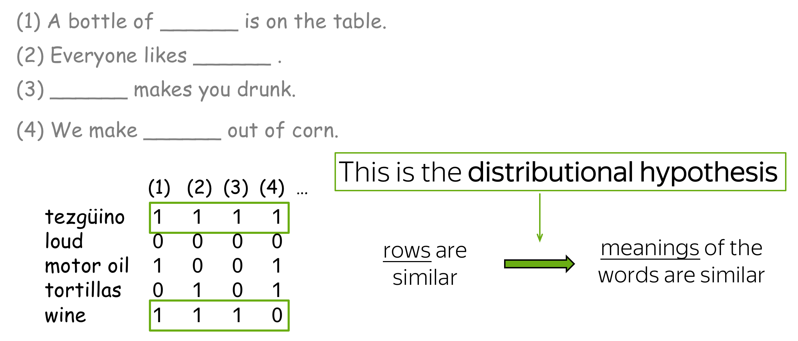

---
# You can also start simply with 'default'
theme: seriph
# random image from a curated Unsplash collection by Anthony
# like them? see https://unsplash.com/collections/94734566/slidev
background: https://cover.sli.dev
# some information about your slides (markdown enabled)
title: Welcome to Slidev
info: |
  ## Slidev Starter Template
  Presentation slides for developers.

  Learn more at [Sli.dev](https://sli.dev)
# apply unocss classes to the current slide
class: text-center
# https://sli.dev/features/drawing
drawings:
  persist: false
# slide transition: https://sli.dev/guide/animations.html#slide-transitions
transition: slide-left
# enable MDC Syntax: https://sli.dev/features/mdc
mdc: true

fonts:
  # basically the text
  sans: Source Han Sans 
  # use with `font-serif` css class from UnoCSS
  serif: Source Han Serif
  bold: Source Han Sans Bold
---

### 心研社学工作坊 

## 自然语言处理在社会科学中的应用 (part1)

日本东北大学 计算人文社会学

吕泽宇

  <a href="https://github.com/lvzeyu/social_science_nlp_tutorial" target="_blank" class="slidev-icon-btn">
    <carbon:logo-github />
  </a>

<!--
The last comment block of each slide will be treated as slide notes. It will be visible and editable in Presenter Mode along with the slide. [Read more in the docs](https://sli.dev/guide/syntax.html#notes)
-->

---
transition: fade-out
---

# 自我介绍

- **所属**: 日本东北大学 文学研究科 [计算人文社会学研究室](https://www.sal.tohoku.ac.jp/jp/research/researcher/profile/---id-190.html) 副教授
- **主要经历**: 博士期间隶属于[日本学术振兴会特别研究员DC2](https://www.jsps.go.jp/j-pd/), [東北大学WISE Program for AI Electronics](https://www.aie.tohoku.ac.jp/), [東北大学Division for Interdisciplinary Advanced Research and Education](http://www.iiare.tohoku.ac.jp/); 在担任[东京大学社会科学研究所](https://jww.iss.u-tokyo.ac.jp/)研究员之后加入目前所属单位.

- **主要研究方向**
    - 基于大规模移动数据关于社会空间隔离(Social spatial segregation)的实证分析和社会模拟
    - <v-click>关于网络空间上意见形成的实证分析和社会模拟</v-click>
    - <v-after>基于文本的文化演化分析</v-after>

  自然语言处理在社会科学中的应用

<arrow
    v-after
    x1="480"
    y1="345"
    x2="580"
    y2="345"
    color="#146b8c"
    width="3"
    arrowSize="1" />

<!--

-->

---

# 内容构成

## 上午 (9:00~12:00)

- 课程内容介绍
- 自然语言处理的基础
- 词向量 (Word Embeddding)
    - 词向量的概念和基本原理
    - Word2Vec
    - 通过Gensim训练和使用词向量
- 词向量在社会科学中的应用
    - [Garg, Schiebinger, Jurafsky, & Zou (2018)](https://www.pnas.org/doi/10.1073/pnas.1720347115)
    - [Kozlowski, Taddy, & Evans (2019)](https://journals.sagepub.com/doi/full/10.1177/0003122419877135)
    - 研究实践
- Transformer的基本原理

## 下午 (14:00~17:00)

- 基于Transformer的语言模型在文本分析中的应用
    - BERTopic
    - 文本分类
- 大语言模型(LLMs)基础
    - LLMs的基本原理
    - In-context Learning
    - Post-train
- LLMs Agent
    - LLMs Agent的基本原理
    - LLMs Agent在社会科学中的应用与展望
- Q&A

  实际课程可能会根据进度进行部分调整

---
transition: fade-out
---

# 课程说明

- 课程资料可以通过以下链接访问查看
   - 上午部分
   - 下午部分

- 课程中使用的代码在Github上公开
   - 通过资料中的链接可以直接在Google Colab上运行
   - 在本地或者其它云端服务器使用Jupyter Notebook运行(可能需要额外的环境配置)

- 在大多数情况下,本次课程会尽量避免数学和模型内部的详细说明。相关内容请额外参考其它资料。 

---
transition: slide-up
level: 1
---

# 自然语言处理的发展历史

- 自然语言处理（NLP: Natural Language Processing）是一系列让计算机处理人类日常使用的自然语言的技术
    - 对于计算机而言，处理像人类语言这样缺乏明确规则的非结构化数据往往是十分困难的任务

- 在自然语言技术发展早期阶段的主流方法是诸如隐马尔可夫模型（HMM）、线性支持向量机（SVM）以及逻辑回归（logistic regression）等统计机器学习（statistical machine learning）的方法。

  

---
transition: slide-up
level: 2
---

# 自然语言处理的发展历史

- 从2010年代开始, 深度学习的方法开始被广泛地应用于自然语言处理之中

- 2018年，Google发布了名为BERT的模型，确立了「预训练ー微调」的开发范式。
- 生成式AI的持续发展(2019~)

  <!-- 图片 -->
  
  
  <!-- 没有填充的矩形 -->
  <svg width="800" height="400" style="position: absolute; top: 0; left: 0;">
    <rect x="400" y="80" width="300" height="120" stroke="#146b8c" fill="none" stroke-width="3" />
  </svg>

---
transition: fade-out
level: 1
---

# 深度学习的基本原理

神经网络的基本构件: 感知器

感知器是一种接受多个输入并通过加权求和来输出一个「信号」的算法

$$
y= w_1 \cdot x_1+ w_2 \cdot x_2+ b
$$

- 每个输入$x_i$（例如$x_1$和$x_2$）都会有一个对应的权重$w_i$，这些权重控制了每个输入在最终输出中的重要性
- $b$是Bias，它用来调整输出的值，以便模型更好地拟合数据。

  

  一个最基础的感知器可以描述输入变量和输出变量之间的 「线性关系」

---
transition: slide-up
level: 2
---

# 深度学习的基本原理

激活函数

对于基本的感知器的输出结果进行额外的计算

$$
a= w_1 \cdot x_1+ w_2 \cdot x_2+ b
$$

$$
y= h(a)
$$

- $h(\cdot)$代表激活函数

- 例: Step Function

$$
y   = \begin{cases}
          0 \quad (w_1 x_1 + w_2 x_2 + b \leq 0) \\
          1 \quad (w_1 x_1 + w_2 x_2 + b > 0)
      \end{cases}
$$

  

  激活函数可以导入非线性特征, 增强感知器的表现力

---
transition: slide-up
level: 2
---

# 深度学习的基本原理

激活函数的作用

  

  通过套用不同的激活函数,感知器可以用于不同类型的问题

---
transition: slide-up
level: 2
---

# 深度学习的基本原理

神经网络

- 神经网络:多个感知器的并联和堆叠所实现的多输入、多输出的网络层结构

- 神经网络训练的目的: 根据数据调整每个感知器的内部参数,使得神经网络内部的感知器能综合处理输入的特征值,对于输入数据进行合适的处理,最终得到理想的输出
    - 感知器的内部参数: 权重$w$和Bias $b$
    - 根据数据调整: 训练数据提供“正确”的输入与输出的情报。神经网络会调整内部参数,从而使网络的输出逐渐接近“正确”的输出

  

---
transition: slide-up
level: 2
---

# 深度学习的基本原理

神经网络的参数优化

  

  神经网络参数的核心算法: 反向传播法

---
transition: slide-up
level: 2
---

# 深度学习的基本原理

深度学习的核心功能

- 神经网络的核心功能是将任意向量形式的输入转换为任意向量形式的输出
    - 神经网络接收的输入通常是一个向量(或矩阵)形式的数据，通过网络的多层结构，网络逐渐将输入向量转换成输出

- 许多"任务"都可以被定义为一种“输入-输出”
    - 文本分类
        - 输入: 一段文本
        - 输出: 分类标签

- 神经网络对于多种任务的适应性
    - 将特定任务中对象以向量形式进行表示, (理论上)就可以应用于神经网络

---
transition: fade-out
level: 1
---

# 词向量(Word Embedding)

- 如何用向量(数值数组)来表现文本 ❓
    - 深度学习模型接收向量作为输入和输出
- 以将文本的更小单位（如词语）表示为向量作为出发点 → 词向量
    - 可以在后续处理中将每个词的向量表示组合成整个文本的表示

- 对于词向量的基本要求
   - 词与词向量之间的映射关系
   - 词向量捕捉和表达词语的语义信息

---
transition: slide-up
level: 2
---

# One-hot Encoding

使用One-hot Encoding表示文本

- 假设我们有以下英文句子："I like NLP and AI"
- 为文本中的每个独立词构建一个词汇表，并为每个词分配一个唯一的索引
- 每个词用一个长度等于词汇表大小的向量表示。该向量只有一个位置为 1（对应该词的索引），其余为 0

| 词语   | One-hot Encoding        |
|--------|------------------------|
| I      | [1, 0, 0, 0, 0]        |
| like   | [0, 1, 0, 0, 0]        |
| NLP    | [0, 0, 1, 0, 0]        |
| and    | [0, 0, 0, 1, 0]        |
| AI     | [0, 0, 0, 0, 1]        |

---
transition: slide-up
level: 2
---

# One-hot Encoding

One-hot Encoding的问题

One-hot Encoding的问题

- 算法上的缺陷
    - 高维稀疏
    - 学习效率低
    - ...
- 无法反映语义关系
    - 向量之间的距离或夹角应反映词语间的语义相似程度或者联系
    - 词之间的语义关系可以通过向量运算表达

  

---
transition: fade-out
level: 1
---

# 词向量的语义表达

Semantically-aware Representation

  

---
transition: slide-up
level: 2
---

# Word2Vec

分布假说

> “You shall know a word by the company it keeps（你可以通过其周围的上下文单词来了解一个目标单词）”

  

---
transition: slide-up
level: 2
---

# 分布假说

> “You shall know a word by the company it keeps（你可以通过其周围的上下文单词来了解一个目标单词）”

  

---
transition: slide-up
level: 2
---

# 分布假说

> “You shall know a word by the company it keeps（你可以通过其周围的上下文单词来了解一个目标单词）”

  

---
transition: slide-up
level: 2
---

# 分布假说

> “You shall know a word by the company it keeps（你可以通过其周围的上下文单词来了解一个目标单词）”

  

---
transition: slide-up
level: 2
---

# Word2Vec的训练方法

单词窗口(Word window)

  

  

---
transition: slide-up
level: 2
---

# Word2Vec的训练方法(Skip-gram)

训练任务的构建

- 输入: 中心单词的向量
- 输出: 相应的上下文单词的向量

  

---
transition: slide-up
level: 2
---

# Word2Vec的训练方法(Skip-gram)

训练任务的构建

- 输入层是目标单词的one-hot向量(维度为$1\times |V|$)
    - 其中只有目标单词对应的位置索引被激活

- 经过目标单词嵌入矩阵$W_{|V|\times d}$将其投影为一个$1\times d$的嵌入向量
- 嵌入向量可以和上下文单词嵌入矩阵得到上下文单词的$1\times |V|$的概率向量
    - 每个元素代表词汇表中相应位置的单词在这里出现的概率

  

---
transition: slide-up
level: 2
---

# Word2Vec的训练方法(Skip-gram)

训练任务的构建

  

---
transition: slide-up
level: 2
---

# Word2Vec的训练方法(Skip-gram)

训练任务的构建

  

  模型所需的训练数据可以给予语料库自动构建

---
transition: slide-up
level: 2
---

# Word2Vec的训练方法(Skip-gram)

基于Word2Vec模型的词向量构建

- Word2Vec模型中, 神经网络中输入层和隐藏层之间的权重矩阵通常被视为词向量
    - 权重矩阵$W$的大小为$V\times N$
       - $V$: 词汇表的长度
       - $N$: 自定义的词向量维度（如 100 或 300）
    - 训练过程中，模型根据预测误差通过反向传播来更新权重矩阵
       - 不断地根据语境信息被微调
       - 训练完成后，$W$中的每一行就表示对应词的词向量

  

---
transition: fade-out
level: 1
---

# Word2Vec的实操

Gensim

- Gensim是一个开源的关于自然语言处理的Python库
    - 提供了高效的关于词向量操作的各种实现

---
transition: fade-out
level: 1
---

# Word2Vec在社会科学中的应用

- 利用Word2Vec进行文本分析
   - 作为一种将词语转换为向量表示的技术,可以捕捉和表示文本的语义辅助多种自然语言处理任务
       - 文本分类
       - 文本聚类

- **利用word2vec的训练原理捕捉语义的变迁**
    - 语义随着社会发展而变化,反映了社会意识形态、权力结构和文化焦点的转移
       - 语义定义的内在复杂性
       - 长期间跨度的系统性分析存在困难
    - 利用Word2vec捕捉语义变迁的可能性
       - Word2vec可以实现对于语义的定量化表达,实现不同时期的系统性分析
       - Word2vec的词向量表达依赖于训练语料库, 反映语料库中呈现的词语共现模式和语义关系
           - 不同时代的语料库可以反映相应时代背景下下特定概念的语义特质

---
transition: fade-out
level: 1
---

# Word2Vec的应用

[Garg, Schiebinger, Jurafsky, & Zou (2018)](https://www.pnas.org/doi/10.1073/pnas.1720347115)

- **研究概要**: 利用词向量量化分析了过去一百年美国社会中性别和种族刻板印象的演变
- **数据**:针对特定时间段训练独立的词向量模型(基于Google Books)
    - 词向量都是在20世纪的十年期间的文本数据上独立训练 →　词向量可以反映相应时期的语义关系
- **分析方法**: 运用词向量的几何关系捕捉了相应单词之间的语义关系,以此来捕捉关于特定对象的“刻板印象”
    - 以性别上的职业偏见为例: "护士"的词向量与“女性”的词向量有更高的相似性; “消防员”的词向量与“男性”的词向量有更高的相似性
    - 构建群体向量(以性别分析为例)
        - 为每个性别（男性、女性）创建代表性向量: 选取性别中若干代表性词语（例如代词，如 she, female）的向量的平均值来实现
    - 构建参照对象向量
        - 选取职业名称或形容词并提取其词向量作为参照对象
    - 计算性别向量和参照对象向量之间的关系来量化性别的“刻板印象”

---
transition: slide-up
level: 2
---

# Word2Vec的应用

[Garg, Schiebinger, Jurafsky, & Zou (2018)](https://www.pnas.org/doi/10.1073/pnas.1720347115)

- **分析指标**: 
    - $\text{relative norm distance} = \sum_{v_m \in M} \left( \|v_m - v_1\|_2 - \|v_m - v_2\|_2 \right)$
        - $M$: 参照对象词语（例如职业名称或形容词）的向量集合
        - $v_m$: 集合$M$中每个参照对象词语的词向量
        - $v_1$: 第一个群体（例如男性）的代表性向量，通过取该群体中若干代表性词语（例如代词或姓氏）的向量的平均值得到
        - $v_2$: 第二个群体（例如女性）的代表性向量，同样通过取该群体中若干代表性词语的向量的平均值得到
        - $|u-v|_2$: 向量$u$和$v$之间的欧几里得距离的平方
    - 指标含义
        - 负值表示参照对象词语更倾向于与第一个群体相关联
        - 正值表示参照对象词语更倾向于与第二个群体相关联
        - 绝对值表示与其中一个群体的关联性程度

---
transition: slide-up
level: 2
---

# Word2Vec的应用

[Garg, Schiebinger, Jurafsky, & Zou (2018)](https://www.pnas.org/doi/10.1073/pnas.1720347115)

- 方法的有效性检验: 比较词向量和外部数据(职业的性别比例)中反映的偏见趋势

  

---
transition: slide-up
level: 2
---

# Word2Vec的应用

[Garg, Schiebinger, Jurafsky, & Zou (2018)](https://www.pnas.org/doi/10.1073/pnas.1720347115)

- 方法的有效性检验: 比较词向量和外部数据(职业的性别比例差距)中反映的偏见趋势变化

  

---
transition: fade-out
level: 1
---

# Word2Vec的应用

[Kozlowski, Taddy, & Evans (2019)](https://journals.sagepub.com/doi/full/10.1177/0003122419877135)

- 社会阶层(Class)的文化维度及其演变
    - 社会阶层是一个复杂且多维度的概念: 包含财富、教育、职业、地位等多方面等因素
        - 词向量技术将词语嵌入到一个高维的向量空间中, 在这个空间中，每个维度都可能蕴含着一定的"文化"意义
    - 不同阶层维度之间关系的动态变化
        - 基于不同历史时期的语料训练的词向量模型可以反映随时间演变的动态变化

- [Kozlowski, Taddy, & Evans (2019)](https://journals.sagepub.com/doi/full/10.1177/0003122419877135)详细阐述了如何利用词向量技术实现针对复杂概念的分析
    - 利用词向量的计算构建理解特定复杂概念的维度
    - 利用词向量的计算理解概念与维度之间的关系
    - 利用词向量的计算理解不同维度之间的关系
    - 利用词向量的计算理解维度语义的演变

---
transition: slide-up
level: 2
---

# 利用词向量的计算构建理解特定复杂概念的维度

[Kozlowski, Taddy, & Evans (2019)](https://journals.sagepub.com/doi/full/10.1177/0003122419877135)

- **构建维度**: 计算一组具有相反语义的词语集合之间词向量差的平均值
    - 构建“*富裕*”维度: 计算“rich” - “poor”，“priceless” - “worthless”等词对的向量差的平均值
- **词语在文化维度上的投影**: 通过计算其他词语的向量在这个维度向量上的正交投影（即余弦相似度），来确定该词语与该文化维度的关联程度
    - 某个词语的向量与文化维度向量之间的夹角越小, 说明它们之间的关系越紧密(余弦相似度越高)

$$cos(\theta))=\frac{D \cdot V}{|D||V|}$$

$$\theta = \arccos(cos(\theta))$$

  

---
transition: slide-up
level: 2
---

# 利用词向量的计算维度的演变

[Kozlowski, Taddy, & Evans (2019)](https://journals.sagepub.com/doi/full/10.1177/0003122419877135)

- **不同维度之间的关系**: 通过计算不同文化维度向量之间的角度（余弦相似度），可以了解这些维度在文化意义上的关联性和独立性
    - 如果两个维度的向量之间的角度接近90度，则表明它们在语义概念上相对独立
- 基于在不同时期语料库上训练的词向量模型可以帮助理解维度关系的演变
    - “富裕”维度在二十世纪初与“文化修养”和“地位”维度最为接近

  

---
transition: slide-up
level: 2
---

# 利用词向量的计算维度语义的演变

[Kozlowski, Taddy, & Evans (2019)](https://journals.sagepub.com/doi/full/10.1177/0003122419877135)

- **维度语义的演变**

    - 计算维度向量在每个十年的词语投影与之后每个十年的词语投影之间的相关性
- 社会阶层的基本维度结构是稳定的，但构成这些维度的具体词语的文化意义和相对位置也在不断演变
    - 在财富维度上，1900 年代被认为是“富裕”的词语，与 1990 年代被认为是“富裕”的词语，其相对排序仍然有很高的相关性，但随着时间的推移，这种相关性会减弱。
    - 不同维度下降速度的差异

  

---
transition: fade-out
level: 1
---

# Word2Vec的应用

Historical Representations of Well-being

- 利用词向量模型理解"Well-being"的维度及其演变
    - "Well-being"是一个复杂且多维度的概念
        - Hedonic Well-being(享乐式幸福):以快乐和痛苦的减少为核心目标，强调短期的满足和愉悦
        - Eudaimonic Well-being: 关注 自我实现、个人成长、目标感、意义感，认为幸福不仅仅是快乐，而是实现人的潜力和内在价值
    - 不同时期Well-being侧重点变化

- 使用日本国会图书馆所提供的包含1910 年代至 1980 年代期间出版的杂志、书籍和官方公报的语料库
- 按年份进行切分，并为每个时间段训练特定的词向量模型

---
transition: slide-up
level: 2
---

# Word2Vec的应用

Historical Representations of Well-being

  

  

---
transition: slide-up
level: 2
---

# Word2Vec的应用

Historical Representations of Well-being

  

---
transition: slide-up
level: 2
---

# Word2Vec的应用

Historical Representations of Well-being

- Well-being与不同维度之间的相关性的演变

  

