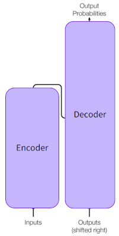
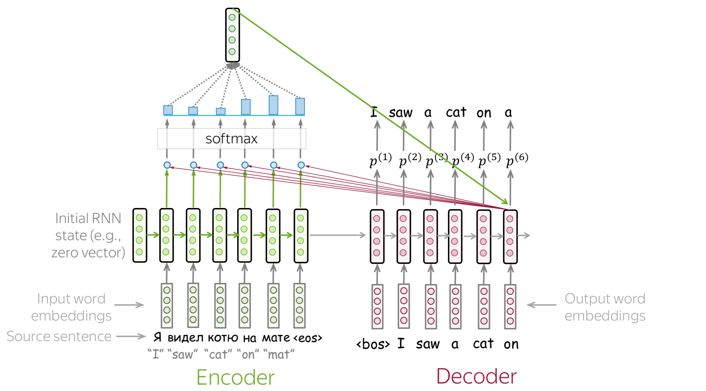
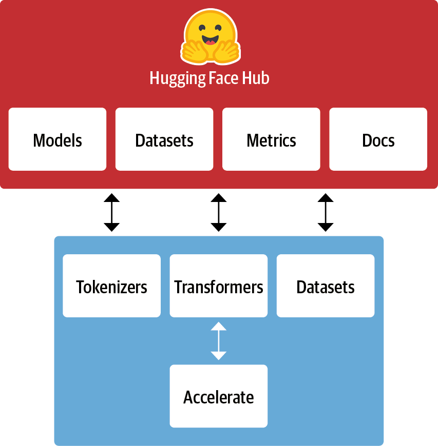

---
# You can also start simply with 'default'
theme: seriph
# random image from a curated Unsplash collection by Anthony
# like them? see https://unsplash.com/collections/94734566/slidev
background: https://cover.sli.dev
# some information about your slides (markdown enabled)
title: Welcome to Slidev
info: |
  ## Slidev Starter Template
  Presentation slides for developers.

  Learn more at [Sli.dev](https://sli.dev)
# apply unocss classes to the current slide
class: text-center
# https://sli.dev/features/drawing
drawings:
  persist: false
# slide transition: https://sli.dev/guide/animations.html#slide-transitions
transition: slide-left
# enable MDC Syntax: https://sli.dev/features/mdc
mdc: true

fonts:
  # basically the text
  sans: Source Han Sans 
  # use with `font-serif` css class from UnoCSS
  serif: Source Han Serif
  bold: Source Han Sans Bold
---

### <span style="color:grey;">心研社学工作坊 </span>

## 自然语言处理在社会科学中的应用

### <span style="color:grey;"> Part2 </span>


日本东北大学 计算人文社会学

吕泽宇

<div class="abs-br m-6 text-xl">
  <a href="https://github.com/slidevjs/slidev" target="_blank" class="slidev-icon-btn">
    <carbon:logo-github />
  </a>
</div>

<!--
The last comment block of each slide will be treated as slide notes. It will be visible and editable in Presenter Mode along with the slide. [Read more in the docs](https://sli.dev/guide/syntax.html#notes)
-->


---
transition: fade-out
level: 1
---

# 内容概要

- BERT的基本原理
    - Transformer的基本原理
    - 预训练(Pre-train)和微调(Fine-tuning)
- BERT的应用
    - BERTopic
    - 基于BERT的文本分类

---
transition: fade-out
level: 1
---

# BERT的直观理解

Word2Vec模型的局限

<div grid="~ cols-2 gap-4">
<div>

- Word2Vec是一个"静态"的词向量模型
    -  Word2Vec为每个词分配一个固定的向量表示，忽略其在不同上下文中的语义变化
    -  尤其难以处理处理多义词和同形异义词

- Word2Vec 仅在局部上下文窗口内进行词共现建模，无法捕捉长距离依赖或整句层面的语义关系
</div>

<div>

<div style="display: flex; justify-content: center;">
  
</div>
</div>
</div>

---
transition: slide-up
level: 2
---

# BERT的直观理解


<div grid="~ cols-2 gap-4">
<div style="display: flex; justify-content: center;">
  
</div>

<div>

<div style="display: flex; justify-content: center;">
  
</div>
</div>
</div>

<p v-click style="color: #146b8c; font-size: 1.5em; text-align: center;">
  BERT对每个词进行动态建模，其表示向量由整句上下文共同决定
</p>

---
transition: slide-up
level: 2
---

# BERT的直观理解

BERT广泛的应用潜力

- 上下文感知的语言表示（Contextualized Language Representations）增强了语义理解能力
    - 理解更为复杂的语言现象
    - > He deposited cash at the bank.　→　“bank” 表示金融机构
    - > They had a picnic on the bank of the river.　→　“bank” 表示河岸
- 预训练(Pre-train)和微调(Fine-tuning)
    -  迁移学习（Transfer Learning）的实现: 以在大规模语料上通过无监督方式进行语言建模预训练，然后在下游任务上微调的方式应用模型
        - 微调所对于数据数据的规模和算力的要求更低
    - 基于BERT的结构调整可以使模型适配多种自然语言处理任务
        - 文本分类
        - 文本生成
        - ....
---
transition: fade-out
level: 1
---

# Transformer的基本原理

Transformer概要

<div grid="~ cols-2 gap-4">
<div>

- Transformer 是一种基于**注意力(Attention)**机制的**Seq2Seq**（Sequence-to-Sequence）深度神经网络架构
    - 可以通过并行高效处理输入与输出序列之间的全局依赖关系
- Transformer 被广泛应用于自然语言处理任务,并成为后续许多预训练语言模型（如 BERT、GPT、T5）的基础架构。
</div>

<div>

<div style="display: flex; justify-content: center;">
  
</div>
</div>
</div>

---
transition: slide-up
level: 2
---

# Transformer的基本原理

seq2seq

<div grid="~ cols-2 gap-4">
<div>

- Transformer 的结构分为 编码器（Encoder） 和 解码器（Decoder） 两部分，整体用于处理从输入到输出的转换过程。
    - 编码器(Encoder)
        - 接收输入序列(文字)，将其编码成一个固定长度的向量
    - 解码器（Decoder）
        - 从编码器生成的表示出发，生成输出序列中的每个词。

</div>

<div>

<div style="display: flex; justify-content: center;">
  
</div>
</div>
</div>

---
transition: slide-up
level: 2
---

# Transformer的基本原理

seq2seq

<video controls width="700" style="display: block; margin-left: auto; margin-right: auto;">
  <source src="./image/seq2seq_training_with_target.mp4" type="video/mp4">
</video>

---
transition: slide-up
level: 2
---

# Transformer的基本原理

<div grid="~ cols-2 gap-4">
<div>

(基于RNN的)seq2seq模型的问题

- 通常按顺序处理序列中的每个元素。这意味着每次计算时都需要等待前一步的输出,训练速度相对较慢


</div>

<div>

<div style="display: flex; justify-content: center;">
  
</div>
</div>
</div>

- 基于 RNN 的 Seq2Seq 模型中，编码器会将整个输入序列压缩为一个固定长度的向量作为上下文表示，然后解码器从这个向量开始生成输出序列
    - 固定长度的上下文向量通常无法充分表达输入序列中的所有重要信息
    - 当模型试图依赖输入序列的远端信息时，模型往往会忘记或无法有效处理远距离的依赖


> Tom was watching TV in his home. Mary came into the room. Mary said hi to 「？」

---
transition: fade-out
level: 1
---

# Transformer的基本原理

注意力模型(Attention)

<div style="display: flex; justify-content: center;">
  
</div>

<p v-click style="color: #146b8c; font-size: 1.5em; text-align: center;">
  模型在处理输入的每个词时，考虑整个输入序列中其他所有词的影响
</p>

---
transition: slide-up
level: 2
---

# Transformer的基本原理

注意力模型(Attention)

<v-switch>
      <template #1>
        
      </template>
      <template #2>
        
      </template>
      <template #3>
        
      </template>
      <template #4>
        
      </template>
      <template #5>
        
      </template>
      <template #6>
        
      </template>
      <template #7>
        
      </template>
      <template #8>
        
      </template>
    </v-switch>

---
transition: slide-up
level: 2
---

# Transformer的基本原理

自注意力机制(Self-Attention)

<div grid="~ cols-2 gap-4">
<div>

- 计算一个输入序列中每个元素对序列其他元素的Attention
   - 长距离依赖建模: 自注意力机制能够直接建模输入序列中任意两个位置之间的关系，从而有效捕捉长距离依赖
   - 并行化计算: 自注意力机制允许序列中所有元素同时处理，因此可以高效并行化计算，显著提高训练速度
</div>

<div>

<video controls width="700" style="display: block; margin-left: auto; margin-right: auto;">
  <source src="./image/encoder_self_attention.mp4" type="video/mp4">
</video>
</div>
</div>


<p v-click style="color: #146b8c; font-size: 2em; text-align: center; margin: 80px;">
  自注意力机制使大语言模型的训练成为可能
</p>

---
transition: slide-up
level: 2
---

# Transformer的基本原理

自注意力机制(Self-Attention)
<div grid="~ cols-2 gap-4">
<div>

- 自注意力机制通过计算注意力权重反映在处理特定单词时，权衡同一个输入句子中不同单词的重要性
- 自注意力机制中的参数会在基于大规模语料库的训练过程中不断被调整, 最终实现对于句子中单词之间的语境和关系的“理解”
   - 自注意力机制中包含了大量矩阵运算
       - 矩阵中的要素构成了自注意力机制中的参数
   - 例:"it" 的指代问题
</div>

<div>

<div style="display: flex; justify-content: center;">
  
</div>
</div>
</div>

---
transition: slide-up
level: 2
---

# Transformer的基本原理

Encoder 和 Decoder

<div grid="~ cols-2 gap-4">
<div>

  - 编码器(Encoder)
      - 接收输入序列(文字)，将其编码成一个固定长度的向量
      - BERT的核心目标是将输入的词序列映射为上下文相关的表示向量（contextual representations）
  - 解码器（Decoder）
      - 从编码器生成的表示出发，生成输出序列中的每个词。
      - GPT的核心目标使用基于语境逐词预测下一个词
</div>

<div>

<v-switch>
      <template #1>
        
      </template>
      <template #2>
        
      </template>
    </v-switch>
</div>
</div>

---
transition: slide-up
level: 1
---

# BERT

BERT的基本结构

<div grid="~ cols-2 gap-4">
<div>

- BERT 是基于 Transformer 编码器（Encoder）堆叠而成的模型

    - 每一层包含大量的权重矩阵和偏置项，随着层数的增加，这些参数数量会成比例地增加

</div>

<div>

<div style="display: flex; justify-content: center;">
  
</div>
</div>
</div>

- BERT 通过 自监督学习（Self-Supervised Learning）任务来训练模型，并在训练过程中通过调整参数来优化其语言理解能力
    - Masked Language Model
       - 在输入的句子中，随机遮蔽一些单词，然后让模型预测这些被遮蔽的单词
    - Next Sentence Prediction
       - 模型接受一对句子，并预测第二个句子是否紧跟在第一个句子之后


---
transition: slide-up
level: 2
---

# BERT

 迁移学习（Transfer Learning）

<div grid="~ cols-2 gap-4">
<div>

- BERT 首先在大规模的语料库上进行预训练（Pre-training）
    - 在预训练阶段，BERT 获取了丰富的语言知识，如语法结构、上下文关系等，成为一个 通用的语言表示模型
- BERT 可以被微调（Fine-tuning）以适应具体的下游任务
    - BERT 模型会根据特定任务的标签数据进行进一步训练
    - 模型能够将 预训练获得的通用知识转移到特定任务上，并根据任务的特点进行调整

</div>

<div>

<div style="display: flex; justify-content: center;">
  
</div>

</div>
</div>

---
transition: fade-out
level: 1
---

# Huggingface


<div grid="~ cols-2 gap-4">
<div>

Huggingface transformer是一个开源库，旨在高效地利用以Transformer为基础的最前沿自然语言处理模型

- [Huggingface Hub](https://huggingface.co/models)上公开了大量预训练模型
- 简化模型使用
    - 通过API使得用户可以便捷地下载预训练模型并对其进行特定任务的微调
- 多框架兼容性
    - 支持 PyTorch和TensorFlow等深度学习框架

</div>

<div>

<div style="display: flex; justify-content: center;">
  
</div>

</div>
</div>


---
transition: slide-up
level: 1
---

# BERT的应用: BERTopic

主题模型

<div grid="~ cols-2 gap-4">
<div>

- 主题模型旨在从大量的文本数据中自动提取潜在的主题结构，从而帮助研究者理解和总结文本内容的主要结构和信息

- LDA（Latent Dirichlet Allocation）是一种常用的基于生成模型的主题建模方法
   - 假设文档是由多个潜在主题混合而成，且每个主题由一组单词的概率分布表示，来从大量的文本数据中自动发现潜在的主题结构
   - 利用文档中单词的分布规律来推测潜在的主题和每个主题下的词汇分布

</div>

<div>

<div style="display: flex; justify-content: center;">
  
</div>


</div>
</div>
<p v-click style="color: #146b8c; font-size: 1.5em; text-align: center;">
  只能捕捉单词级别的统计信息，忽略了上下文和语义
</p>


---
transition: slide-up
level: 2
---

# BERT的应用: BERTopic

BERTopic的基本原理

<div grid="~ cols-2 gap-4">
<div>

BERTopic通过BERT(或其变体)的语义表示能力和聚类算法进行主题建模
- LDA（Latent Dirichlet Allocation）是一种常用的基于生成模型的主题建模方法
   - 文本表示: 利用 BERT 或其变体（如 RoBERTa、DistilBERT 等）将文本数据转换为嵌入向量
   - 降维： 通过降维技术将高维的嵌入向量映射到低维空间
   - 聚类:  低维表示的文本数据通过聚类算法进行分组
   - 主题生成: 在每个聚类中，通过提取最具代表性的关键词来为每个主题命名和描述

</div>

<div>

<div style="display: flex; justify-content: center;">
  
</div>


</div>
</div>

---
transition: slide-up
level: 1
---

# BERT的应用: 文本分类


- BERT 首先在大规模的语料库上进行预训练（Pre-training）
    - 在预训练阶段，BERT 获取了丰富的语言知识，如语法结构、上下文关系等，成为一个 通用的语言表示模型
- BERT 可以被微调（Fine-tuning）以适应具体的下游任务
    - BERT 模型会根据特定任务的标签数据进行进一步训练
    - 模型能够将 预训练获得的通用知识转移到特定任务上，并根据任务的特点进行调整

<div style="display: flex; justify-content: center;">
  
</div>


---
transition: slide-up
level: 1
---

# Code

Use code snippets and get the highlighting directly, and even types hover!

````md magic-move {lines: true}
```ts {*|3|*}
from transformers import AutoTokenizer
from transformers import AutoModel
model_ckpt = "distilbert-base-uncased"
tokenizer = AutoTokenizer.from_pretrained(model_ckpt)
model = AutoModel.from_pretrained(model_ckpt).to(device)
```

```ts {*|1-2|3-4|3-4,8}
from transformers import AutoTokenizer
from transformers import AutoModel
model_ckpt = "bert-base-chinese"
tokenizer = AutoTokenizer.from_pretrained(model_ckpt)
model = AutoModel.from_pretrained(model_ckpt).to(device)

```

```

---
level: 2
---

# Shiki Magic Move

Powered by [shiki-magic-move](https://shiki-magic-move.netlify.app/), Slidev supports animations across multiple code snippets.

Add multiple code blocks and wrap them with <code>````md magic-move</code> (four backticks) to enable the magic move. For example:

````md magic-move {lines: true}
```ts {*|2|*}
// step 1
const author = reactive({
  name: 'John Doe',
  books: [
    'Vue 2 - Advanced Guide',
    'Vue 3 - Basic Guide',
    'Vue 4 - The Mystery'
  ]
})
```

```ts {*|1-2|3-4|3-4,8}
// step 2
export default {
  data() {
    return {
      author: {
        name: 'John Doe',
        books: [
          'Vue 2 - Advanced Guide',
          'Vue 3 - Basic Guide',
          'Vue 4 - The Mystery'
        ]
      }
    }
  }
}
```

```ts
// step 3
export default {
  data: () => ({
    author: {
      name: 'John Doe',
      books: [
        'Vue 2 - Advanced Guide',
        'Vue 3 - Basic Guide',
        'Vue 4 - The Mystery'
      ]
    }
  })
}
```

Non-code blocks are ignored.

```vue
<!-- step 4 -->
<script setup>
const author = {
  name: 'John Doe',
  books: [
    'Vue 2 - Advanced Guide',
    'Vue 3 - Basic Guide',
    'Vue 4 - The Mystery'
  ]
}
</script>
```
````

---

# Components

<div grid="~ cols-2 gap-4">
<div>

You can use Vue components directly inside your slides.

We have provided a few built-in components like `<Tweet/>` and `<Youtube/>` that you can use directly. And adding your custom components is also super easy.

```html
<Counter :count="10" />
```

<!-- ./components/Counter.vue -->
<Counter :count="10" m="t-4" />

Check out [the guides](https://sli.dev/builtin/components.html) for more.

</div>
<div>

```html
<Tweet id="1390115482657726468" />
```

<Tweet id="1390115482657726468" scale="0.65" />

</div>
</div>

<!--
Presenter note with **bold**, *italic*, and ~~striked~~ text.

Also, HTML elements are valid:
<div class="flex w-full">
  <span style="flex-grow: 1;">Left content</span>
  <span>Right content</span>
</div>
-->

---
class: px-20
---

# Themes

Slidev comes with powerful theming support. Themes can provide styles, layouts, components, or even configurations for tools. Switching between themes by just **one edit** in your frontmatter:

<div grid="~ cols-2 gap-2" m="t-2">

```yaml
---
theme: default
---
```

```yaml
---
theme: seriph
---
```


</div>

Read more about [How to use a theme](https://sli.dev/guide/theme-addon#use-theme) and
check out the [Awesome Themes Gallery](https://sli.dev/resources/theme-gallery).

---

# Clicks Animations

You can add `v-click` to elements to add a click animation.

<div v-click>

This shows up when you click the slide:

```html
<div v-click>This shows up when you click the slide.</div>
```

</div>

<br>

<v-click>

The <span v-mark.red="3"><code>v-mark</code> directive</span>
also allows you to add
<span v-mark.circle.orange="4">inline marks</span>
, powered by [Rough Notation](https://roughnotation.com/):

```html
<span v-mark.underline.orange>inline markers</span>
```

</v-click>

<div mt-20 v-click>

[Learn more](https://sli.dev/guide/animations#click-animation)

</div>

---

# Motions

Motion animations are powered by [@vueuse/motion](https://motion.vueuse.org/), triggered by `v-motion` directive.

```html
<div
  v-motion
  :initial="{ x: -80 }"
  :enter="{ x: 0 }"
  :click-3="{ x: 80 }"
  :leave="{ x: 1000 }"
>
  Slidev
</div>
```

<div class="w-60 relative">
  <div class="relative w-40 h-40">
    
    
    
  </div>

  <div
    class="text-5xl absolute top-14 left-40 text-[#2B90B6] -z-1"
    v-motion
    :initial="{ x: -80, opacity: 0}"
    :enter="{ x: 0, opacity: 1, transition: { delay: 2000, duration: 1000 } }">
    Slidev
  </div>
</div>

<!-- vue script setup scripts can be directly used in markdown, and will only affects current page -->
<script setup lang="ts">
const final = {
  x: 0,
  y: 0,
  rotate: 0,
  scale: 1,
  transition: {
    type: 'spring',
    damping: 10,
    stiffness: 20,
    mass: 2
  }
}
</script>

<div
  v-motion
  :initial="{ x:35, y: 30, opacity: 0}"
  :enter="{ y: 0, opacity: 1, transition: { delay: 3500 } }">

[Learn more](https://sli.dev/guide/animations.html#motion)

</div>

---

# LaTeX

LaTeX is supported out-of-box. Powered by [KaTeX](https://katex.org/).

<div h-3 />

Inline $\sqrt{3x-1}+(1+x)^2$

Block
$$ {1|3|all}
\begin{aligned}
\nabla \cdot \vec{E} &= \frac{\rho}{\varepsilon_0} \\
\nabla \cdot \vec{B} &= 0 \\
\nabla \times \vec{E} &= -\frac{\partial\vec{B}}{\partial t} \\
\nabla \times \vec{B} &= \mu_0\vec{J} + \mu_0\varepsilon_0\frac{\partial\vec{E}}{\partial t}
\end{aligned}
$$

[Learn more](https://sli.dev/features/latex)

---

# Diagrams

You can create diagrams / graphs from textual descriptions, directly in your Markdown.

<div class="grid grid-cols-4 gap-5 pt-4 -mb-6">


</div>

Learn more: [Mermaid Diagrams](https://sli.dev/features/mermaid) and [PlantUML Diagrams](https://sli.dev/features/plantuml)

---
foo: bar
dragPos:
  square: 691,32,167,_,-16
---

# Draggable Elements

Double-click on the draggable elements to edit their positions.

<br>

###### Directive Usage

```md

```

<br>

###### Component Usage

```md
<v-drag text-3xl>
  <div class="i-carbon:arrow-up" />
  Use the `v-drag` component to have a draggable container!
</v-drag>
```

<v-drag pos="663,206,261,_,-15">
  <div text-center text-3xl border border-main rounded>
    Double-click me!
  </div>
</v-drag>


###### Draggable Arrow

```md
<v-drag-arrow two-way />
```

<v-drag-arrow pos="67,452,253,46" two-way op70 />

---
src: ./pages/imported-slides.md
hide: false
---

---

# Monaco Editor

Slidev provides built-in Monaco Editor support.

Add `{monaco}` to the code block to turn it into an editor:

```ts {monaco}
import { ref } from 'vue'
import { emptyArray } from './external'

const arr = ref(emptyArray(10))
```

Use `{monaco-run}` to create an editor that can execute the code directly in the slide:

```ts {monaco-run}
import { version } from 'vue'
import { emptyArray, sayHello } from './external'

sayHello()
console.log(`vue ${version}`)
console.log(emptyArray<number>(10).reduce(fib => [...fib, fib.at(-1)! + fib.at(-2)!], [1, 1]))
```

---
layout: center
class: text-center
---

# Learn More

[Documentation](https://sli.dev) · [GitHub](https://github.com/slidevjs/slidev) · [Showcases](https://sli.dev/resources/showcases)

<PoweredBySlidev mt-10 />
