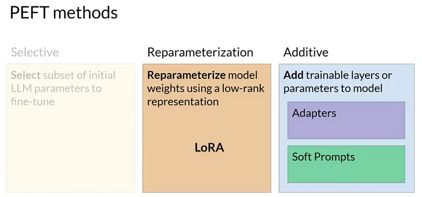
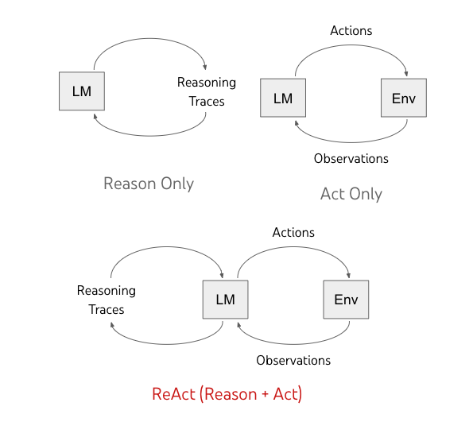

---
# You can also start simply with 'default'
theme: seriph
# random image from a curated Unsplash collection by Anthony
# like them? see https://unsplash.com/collections/94734566/slidev
background: https://cover.sli.dev
# some information about your slides (markdown enabled)
title: Welcome to Slidev
info: |
  ## Slidev Starter Template
  Presentation slides for developers.

  Learn more at [Sli.dev](https://sli.dev)
# apply unocss classes to the current slide
class: text-center
# https://sli.dev/features/drawing
drawings:
  persist: false
# slide transition: https://sli.dev/guide/animations.html#slide-transitions
transition: slide-left
# enable MDC Syntax: https://sli.dev/features/mdc
mdc: true

fonts:
  # basically the text
  sans: Source Han Sans 
  # use with `font-serif` css class from UnoCSS
  serif: Source Han Serif
  bold: Source Han Sans Bold
---

### <span style="color:grey;">心研社学工作坊 </span>

## 自然语言处理在社会科学中的应用

### <span style="color:grey;"> Part3 </span>


日本东北大学 计算人文社会学

吕泽宇

<div class="abs-br m-6 text-xl">
  <a href="https://github.com/lvzeyu/social_science_nlp_tutorial" target="_blank" class="slidev-icon-btn">
    <carbon:logo-github />
  </a>
</div>

<!--
The last comment block of each slide will be treated as slide notes. It will be visible and editable in Presenter Mode along with the slide.
-->

---
transition: fade-out
level: 1
---

# 大语言模型的基本概念

What is GPT?

GPT
- **G**: **G**enerative model
   - 生成式模型: 通过自回归方式（auto-regressive），一个词接一个词地预测下一个词，从而生成连贯自然的文本
- **P**: **P**re-trained
    - 预训练：在大规模语料上，以语言建模任务进行自监督学习，使模型学习到通用的语言知识和语义表示能力
- **T**: **T**ransformer
    - 基于 Transformer 架构(Decoder)的模型


---
transition: slide-up
level: 2
---

# 大语言模型的基本概念

生成式模型

<div style="display: flex; justify-content: center;">
  
</div>

---
transition: slide-up
level: 2
---

# 大语言模型的基本概念

“几乎所有 NLP 任务”都能转化为文本生成

| 任务     | 输入示例                              | 输出示例                         | 生成式转化形式（Prompt）                     |
|--------------|---------------------------------------|----------------------------------|-----------------------------------------------|
| 文本分类     | 一段文本：This movie is fantastic.    | Positive                         | Text: This movie is fantastic. Sentiment: ___ |
| 问答         | 问题：Who wrote Hamlet?               | William Shakespeare              | Q: Who wrote Hamlet? A: ___                    |
| 翻译         | 英文句子：How are you?                | 法文：Comment ça va ?            | Translate English to French: How are you? ___ |
| 摘要         | 文章：Artificial intelligence...      | 简要：AI is a branch of CS...    | Summarize the following: Artificial... ___    |


---
transition: slide-up
level: 2
---

# 大语言模型的基本概念

Emergent Abilities

<div style="display: flex; justify-content: center;">
  
</div>

<div class="abs-br m-6 text-xl">
  <a href="https://arxiv.org/abs/2206.07682" target="_blank" class="slidev-icon-btn">
    <carbon:document />
  </a>
</div>

---
transition: slide-up
level: 2
---

# 大语言模型的基本概念

Pos-training

- Prompting
- Instruction fine-tuning
- Opitimizing for human preferences
- Parameter efficient tuning(PEFT)


---
transition: fade-out
level: 1
---

# Prompting

In-context learning

<div grid="~ cols-2 gap-4">
<div>


- 通过在输入提示（prompt）中提供示例，使模型根据上下文完成下游任务
    - 通过在预训练中观察了各种任务格式的文本数据（问答、翻译、摘要等），模型学会了在不同上下文中，如何对接下来的内容进行合理推断
    - 虽然模型参数没有更新,但是LLMs可以实现对齐输入与输出的映射
        - 依赖于大规模语言模型（LLMs）的庞大参数量和训练规模

</div>

<div>

<div style="display: flex; justify-content: center;">
  
</div>
</div>
</div>


---
transition: slide-up
level: 2
---

# Prompting

In-context learning

<div style="display: flex; justify-content: center;">
  
</div>

<div class="abs-br m-6 text-xl">
  <a href="https://arxiv.org/abs/2005.14165" target="_blank" class="slidev-icon-btn">
    <carbon:document />
  </a>
</div>

---
transition: slide-up
level: 2
---

# Prompting

面对高复杂性任务时存在欠缺

- 有些任务即使对于大型语言模型而言，仅通过提示学习也显得过于困难
- 尤其是那些涉及更丰富、多个步骤推理的任务

$$
19583+29534=49117
$$

$$
98394+49384=147778
$$

$$
93847+39299=?
$$

---
transition: slide-up
level: 2
---

# Prompting

Chain-of-thought prompting

<div style="display: flex; justify-content: center;">
  
</div>

<div class="abs-br m-6 text-xl">
  <a href="https://arxiv.org/abs/2201.11903" target="_blank" class="slidev-icon-btn">
    <carbon:document />
  </a>
</div>

---
transition: slide-up
level: 2
---

# Prompting

Zero-shot COT Prompting

<div style="display: flex; justify-content: center;">
  
</div>

<div class="abs-br m-6 text-xl">
  <a href="https://arxiv.org/abs/2201.11903" target="_blank" class="slidev-icon-btn">
    <carbon:document />
  </a>
</div>


---
transition: slide-up
level: 2
---

# Prompting

Zero-shot COT Prompting

<div style="display: flex; justify-content: center;">
  
</div>

<div class="abs-br m-6 text-xl">
  <a href="https://web.stanford.edu/class/cs224n/slides/cs224n-spr2024-lecture10-prompting-rlhf.pdf" target="_blank" class="slidev-icon-btn">
    <carbon:document />
  </a>
</div>


---
transition: fade-out
level: 2
---

# Instruction finetuning

- 尽管大模型已经通过大规模文本预训练掌握了大量知识，但在具体任务上，“如何让模型听懂你的话” 是个难题
- 预训练模型对任务指令理解能力有限
    - 预训练的语言模型本质上是 “预测下一个词”，它并没有学过「指令→任务」的结构

- Instruction fine-tuning 是在预训练模型的基础上，使用大量的 带指令的示例（instruction + input → output） 进行监督学习
    - 提高模型可控性与对齐程度
    - 增强任务泛化能力: 模型学习了如何从语言中“理解任务”
> Instruction: 请将以下句子翻译为英文。
  Input: 我今天很开心。
  Output: I am very happy today.

---
transition: slide-up
level: 2
---

# Instruction finetuning

-  FLAN-T5由 在原始T5架构的语言模型上进行 instruction fine-tuning 所得到的强指令响应模型

<div style="display: flex; justify-content: center;">
  
</div>

---
transition: slide-up
level: 2
---

# Instruction finetuning

- 在包含部分 Chain-of-Thought（CoT）数据的混合任务上进行微调，可以促使模型在未见任务中具备 Zero-shot 的链式推理能力

<div style="display: flex; justify-content: center;">
  
</div>

<div class="abs-br m-6 text-xl">
  <a href="https://arxiv.org/abs/2210.11416" target="_blank" class="slidev-icon-btn">
    <carbon:document />
  </a>
</div>

---
transition: fade-out
level: 1
---

# Optimizing for human preferences

语言模型的目标 ≠ 符合人类偏好

- 语言模型的训练目标和人类期望之间依然存在结构性的不匹配
    - 语言模型的基本目标是一个基于统计规律的下一个词预测任务
    - 模型学习的是“模仿参考答案”，而非“最大化人类的满意度”

- 人类偏好的复杂性
    - 语气与礼貌性
    - 伦理与社会接受性
    - 实用性与信息价值


<p v-click style="color: #146b8c; font-size: 1.5em; text-align: center;">
   引入“人类评分”作为训练信号
</p>

---
transition: slide-up
level: 2
---

# Optimizing for human preferences

RLHF（Reinforcement Learning from Human Feedback）

<div style="display: flex; justify-content: center;">
  
</div>

<div class="abs-br m-6 text-xl">
  <a href="https://arxiv.org/abs/2203.02155" target="_blank" class="slidev-icon-btn">
    <carbon:document />
  </a>
</div>

---
transition: slide-up
level: 2
---

# Optimizing for human preferences

RLHF VS Instruction finetuning

- 许多LLM训练是由Instruction finetuning 与 RLHF 通常是协同完成的
   - Instruction Finetuning提升了模型的指令理解能力与基础任务执行能力
       - 使预训练模型学会“遵循指令、完成任务”
       - 学习方式是学习从输入到输出的全过程(过程驱动)的行为模仿，强调“如何生成”
   -  RLHF构建 Reward Model，以人类偏好作为奖励信号
       - 使模型输出更加对齐于人类期望
       - 学习方式是学习哪种输出效果更好(结果导向)，强调“生成得好不好”
       - 利用偏好作为信号的优势: 人类更擅长做相对判断

---
transition: slide-up
level: 2
---

# Optimizing for human preferences


<div style="display: flex; justify-content: center;">
  
</div>

<div class="abs-br m-6 text-xl">
  <a href="https://openai.com/index/instruction-following/" target="_blank" class="slidev-icon-btn">
    <carbon:document />
  </a>
</div>

---
transition: fade-out
level: 1
---

# Parameter efficient fine-tuning (PEFT)


- 大语言模型的参数量增长到数十亿甚至千亿级别
    - 传统的微调（fine-tuning）所需要的计算资源往往难以得到满足

- PEFT的目标：在仅修改少量参数的前提下进行微调

    - 大模型时代实现高效、低成本、可控任务迁移的关键策略 

<div style="display: flex; justify-content: center;">
  
</div>


---
transition: slide-up
level: 2
---

# Parameter efficient fine-tuning (PEFT)

PEFT的主流方法

- Adapter
    - 在原有 Transformer 层中插入Adapter模块
    - 微调时只更新 Adapter 层的参数
- **LoRA(Low-Rank Adaptation)**

<div style="display: flex; justify-content: center;">
  
</div>


---
transition: slide-up
level: 2
---

# Parameter efficient fine-tuning (PEFT)

LoRA


<div style="display: flex; justify-content: center;">
  
</div>

---
transition: fade-out
level: 1
---

# Parameter efficient fine-tuning (PEFT)

LoRA

<div grid="~ cols-2 gap-4">
<div>


- 冻结预训练模型的全部权重，仅通过引入低秩矩阵（low-rank matrices）对部分参数进行高效微调
    - 低秩矩阵只用少量参数就能高效近似原始矩阵
- LoRA显著提高了计算效率
    - Transformer base模型的权重为$W \in \mathbb{R}^{d \times k}$
        - 参数量是 $d \times k= 512 \times 64 = 32768$
    - LoRA($r=8$)
        - $A$ 的参数量 $r \times k = 8 \times 64 = 512$ 
        - $B$的参数量 $d \times r = 512 \times 8 = 4096$ 
        - 参数量减少了约$86 \%$

</div>

<div>

<div style="display: flex; justify-content: center;">
  
</div>
</div>
</div>


---
transition: slide-up
level: 2
---

# Parameter efficient fine-tuning (PEFT)

LoRA的精度

<div style="display: flex; justify-content: center;">
  
</div>


---
transition: fade-out
level: 1
---

# 量子化语言模型

- 随着语言模型规模的扩大，其参数数量和计算复杂度也显著增加

- 量子化是一种将模型权重从高精度转换为低精度的技术
   - 在提升效率的同时实现性能仅有轻微下降
   - 减少模型的计算资源需求，提高推理速度

<div style="display: flex; justify-content: center;">
  
</div>

---
transition: slide-up
level: 2
---

# 量子化语言模型

- PEFT和量子化语言模型的结合实现了资源高效的大语言模型微调: QLoRA（Quantized Low-Rank Adapter） 
    - [peft](https://github.com/huggingface/peft): 支持 transformers 加载的模型直接添加 PEFT 层
    - [bitsandbytes](https://github.com/bitsandbytes-foundation/bitsandbytes)
    - [Transformers](https://github.com/huggingface/transformers):量子化模型加载和模型构建

````md magic-move {lines: true}


```ts {*|6|*}
# 定义量子化配置
from transformers import BitsAndBytesConfig
bnb_config = BitsAndBytesConfig(
    load_in_4bit=True,
    bnb_4bit_use_double_quant=True,
    bnb_4bit_quant_type="nf4"
)
```

```ts {*|5|*}
#加载量子化模型
from transformers import AutoModelForCausalLM
model = AutoModelForCausalLM.from_pretrained(
    "meta-llama/Llama-2-7b-hf",
    quantization_config=bnb_config,
    device_map="auto"
)
```

```ts {*|4|*}
#定义 PEFT 配置
from peft import get_peft_model, LoraConfig, TaskType
lora_config = LoraConfig(
    r=8,
    lora_alpha=16,
    lora_dropout=0.05,
    target_modules=["q_proj", "v_proj"],
    bias="none",
    task_type=TaskType.CAUSAL_LM
)

model = get_peft_model(base_model, lora_config)
```

```ts
#插入 LoRA 适配器
model = get_peft_model(model, lora_config)

```

````

<div class="abs-br m-6 text-xl">
  <a href="https://arxiv.org/abs/2305.14314" target="_blank" class="slidev-icon-btn">
    <carbon:document />
  </a>
</div>


---
transition: slide-up
level: 1
---

# 大语言模型智能体(LLMs Agent)

大语言模型在应用中存在的问题

- 时效性: 语言模型在预训练时使用的是静态语料
> Prompt: Who is the Prime Minister of the UK?

- 语言模型在算术、逻辑推理等任务上可能会出现错误

> What is 40339 divided by 439?

> strawberry里有几个"r"

- Hallucination 幻觉: 模型为了给出“看起来合理”的答案，有时会"捏造"不存在的内容。

> Prompt: Tell me about the book 'The Lost City of Atlantis' by John Doe.

> Completion: The book 'The Lost City of Atlantis' by John Doe explores the mythical city in great detail.


---
transition: slide-up
level: 2
---

# 大语言模型智能体(LLMs Agent)

<div grid="~ cols-2 gap-4">
<div>


- 大语言模型智能体（LLM Agent）是指一种赋予大语言模型"自律性”和“问题解决能力”的系统结构

- 观察（Observe）: 从环境中接收信息
    -  包括来自外部环境的数据（如网页内容、数据库）

- 思考（Think）: 基于观察到的环境状态和任务输入，进行任务意图建模、策略规划与推理决策

- 行动（Act）: 执行推理结果或调用**工具**完成任务

- 记忆（Memoey）:存储、组织、检索过往交互记录、知识片段或环境状态
</div>

<div>

<div style="display: flex; justify-content: center;">
  
</div>
</div>
</div>


---
transition: slide-up
level: 2
---

# RAG

基于环境中接收信息进行推论

<div grid="~ cols-2 gap-4">
<div>


RAG 是一种将 信息检索（retrieval） 与 生成式语言模型（generation） 相结合的架构，它允许模型在生成文本时动态地访问外部信息

- 检索（Retrieval）: 从外部知识库中找到与输入最相关的信息片段
    - 语义检索:基于向量的语义特征进行近邻搜索
- 生成（Generation）：基于输入与检索结果，生成高质量、有依据的自然语言输出
</div>

<div>

<div style="display: flex; justify-content: center;">
  
</div>
</div>
</div>

- 外部检索支持实时知识更新
- 生成内容基于检索信息，降低幻觉风险


---
transition: slide-up
level: 2
---

# ReAct

Reasoning + Acting

<div grid="~ cols-2 gap-4">
<div>

相对于“单轮输入 → 输出” 的形式, ReAct实现了“ 边思考边执行”
- Reasoning（推理）：模型以自然语言形式生成中间思考步骤
- Acting（行动）：模型根据当前思考选择并输出具体操作指令（如搜索、计算、API 调用）

<p v-click style="margin-top: 2.5em; color: #146b8c; font-size: 1.5em; text-align: center;">
  通过交互式「感知-推理-执行」循环，在动态环境中完成复杂任务
</p>

</div>

<div>

<div style="display: flex; justify-content: center;">
  
</div>
</div>
</div>


---
transition: slide-up
level: 2
---

# ReAct

<div style="display: flex; justify-content: center; align-items: center; flex-direction: column;">
  <v-switch>
    <template #1>
      
    </template>
    <template #2>
      
    </template>
  </v-switch>
</div>


---
transition: slide-up
level: 2
---

# Tool(工具)模块

<div grid="~ cols-2 gap-4">
<div>

在语言模型智能体架构中，Tool 指的是一种外部操作接口
- 语言模型可以调用事先注册或动态绑定的函数、API、服务或子系统，以完成其自身难以直接执行的任务

</div>

<div>

<div style="display: flex; justify-content: center;">
  
</div>
</div>
</div>

- 数学与逻辑工具
    - 执行精确的算术、逻辑或编程操作	
- 外部 API 工具	
    - 通过网络检索访问外部的实时信息

---
transition: slide-up
level: 2
---

# Tool(工具)模块

通过ReAct实现Tool的调用

<div style="display: flex; justify-content: center; align-items: center; flex-direction: column;">
<v-switch>
      <template #1>
        
      </template>
      <template #2>
        
      </template>
      <template #3>
        
      </template>
      <template #4>
        
      </template>
      <template #5>
        
      </template>
</v-switch> 
</div>

---
transition: slide-up
level: 2
---

# Tool(工具)模块

利用langchain实现Tool的调用

````md magic-move {lines: true}


```ts {*|5|6|8-11|*}
from langchain.agents import load_tools
from langchain.agents import initialize_agent
from langchain.llms import OpenAI

llm = OpenAI(temperature=0)
tools = load_tools(["serpapi", "llm-math"], llm=llm)

agent = initialize_agent(tools, 
                         llm, 
                         agent="zero-shot-react-description", 
                         verbose=True)
```

```ts {*|5|*}
#加载量子化模型
from transformers import AutoModelForCausalLM
model = AutoModelForCausalLM.from_pretrained(
    "meta-llama/Llama-2-7b-hf",
    quantization_config=bnb_config,
    device_map="auto"
)
```

```ts 
agent.run("If I square the number for the street address of DeepMind what answer do I get?")
```

```ts
> Entering new AgentExecutor chain...
 I need to use a calculator to square the number.
Action: Calculator
Action Input: 6
Observation: Answer: 6
Thought: I need to use a calculator to square the number.
Action: Calculator
Action Input: 6
Observation: Answer: 6
Thought: I now know the final answer
Final Answer: 36

> Finished chain.

```
````


---
transition: slide-up
level: 2
---

# Memory模块

状态保持与知识回溯机制


- 存储、管理和检索交互历史, 使智能体具备长期对话一致性、任务连续性、用户个性化适应性等能力
    - 短期记忆
    - 摘要式记忆	
    - 检索式记忆	

<div style="display: flex; justify-content: center;">
  
</div>


---
transition: slide-up
level: 2
---

# Memory模块

利用langchain实现Memory的调用

````md magic-move {lines: true}


```ts {*|5|6|8-11|*}
from langchain.chains.conversation.memory import ConversationBufferMemory
from langchain import OpenAI
from langchain.chains import ConversationChain

llm = OpenAI(temperature=0)
memory = ConversationBufferMemory()

conversation = ConversationChain(
    llm=llm, 
    verbose=True, 
    memory=memory
)
```

```ts {*|5|*}
conversation.predict(input="Hi there! I am Sam")

```

```ts

> Entering new ConversationChain chain...
Prompt after formatting:
The following is a friendly conversation between a human and an AI.
The AI is talkative and provides lots of specific details from its context.
If the AI does not know the answer to a question, it truthfully says it does not know.

Current conversation:

Human: Hi there! I am Sam
AI:

> Finished chain.


" Hello Sam! It's nice to meet you. 
  My name is AI and I am an artificial intelligence designed to assist 
  and communicate with humans. How can I help you today?"


```

```ts 
conversation.predict(input="How are you today?")

```

```ts
> Entering new ConversationChain chain...
Prompt after formatting:
The following is a friendly conversation between a human and an AI.
The AI is talkative and provides lots of specific details from its context. 
If the AI does not know the answer to a question, it truthfully says it does not know.

Current conversation:
Human: Hi there! I am Sam
AI:  Hello Sam! It's nice to meet you. 
My name is AI and I am an artificial intelligence designed to assist and communicate with humans.
How can I help you today?
Human: How are you today?
AI:

> Finished chain.

' I am functioning at optimal levels today. 
My processors are running smoothly and my algorithms are performing efficiently. 
 Thank you for asking, Sam. How about you? How are you feeling today?'

```
````

---
transition: fade-out
level: 1
---

# LLMs Agent的应用: 社会模拟

社会模拟的传统方法: Agent-based Model (ABM)

- 通过构建具有自主行为规则的主体（agent），在模拟环境中进行交互、适应、演化与聚合，以研究复杂社会系统的宏观行为如何从微观互动中涌现
   - 模型复杂度: 传统 ABM 多采用规则驱动的主体建模方式
       - 在面对需要复杂决策、策略适应、语言交互或多层次行为演化的社会系统时，模型表达力明显不足,难以真实刻画复杂主体之间的动态关系
   - 模型适应性: ABM 中的主体往往需根据特定研究情境进行定制。
       - 高度依赖场景的构建方式使模型在不同应用场景之间的可迁移性较差，难以支持跨情境、跨系统的模拟研究


---
transition: slide-up
level: 2
---

# LLMs Agent的应用: 社会模拟

基于LLM Agent的社会模拟

- 可通过 Prompt 或微调实现高度异质的行为建模与角色设定
    - 实现大规模异质性智能体的快速构建
- LLM Agent具备自然语言理解、推理、意图识别与规划能力
    - 可以展现出更高水平的行为自主性，能够根据情境变化实时调整自身的行为与策略
    - 做出更加合理、连贯且贴近人类逻辑的行为反应
- 可直接结合新闻、政策、社交媒体等文本信息进行知识注入
    - 增强模拟的现实整合性	


---
transition: slide-up
level: 2
---

# LLMs Agent的应用: 社会模拟

Generative Agents

<div grid="~ cols-2 gap-4">
<div>

- 构建了一个模拟小镇环境，包含多个地点，如咖啡馆、学校和住宅区(利用自然语言)
- ​部署了25个生成式智能体，每个智能体都拥有独特的背景信息、日常计划和行为目标。
    - 记忆（Memory）：​以自然语言形式存储和检索过往经验。​
    - 反思（Reflection）：​对记忆进行整合，形成高层次的洞察，以指导未来行为。​
    - 规划（Planning）：​制定和调整日常计划，响应环境变化。
- 在没有预设任何情节的情况下，智能体之间自发产生了高度拟真的社交行为
</div>

<div>

<div style="display: flex; justify-content: center;">
  
</div>
</div>
</div>

<div class="abs-br m-6 text-xl">
  <a href="https://arxiv.org/abs/2304.03442" target="_blank" class="slidev-icon-btn">
    <carbon:document />
  </a>
</div>

---
transition: slide-up
level: 2
---

# LLMs Agent的应用: 社会模拟

相关的开源工具

<div grid="~ cols-2 gap-4">
  <div>
    <div style="display: flex; flex-direction: column; align-items: center;">
      
      <a href="https://oasis.camel-ai.org/" target="_blank" style="margin-top: 0.5em; font-size: 0.9em; color: #666; text-decoration: underline;">
        OASIS
      </a>
    </div>
  </div>

  <div>
    <div style="display: flex; flex-direction: column; align-items: center;">
      
      <a href="https://github.com/tsinghua-fib-lab/agentsociety" target="_blank" style="margin-top: 0.5em; font-size: 0.9em; color: #666; text-decoration: underline;">
        AgentSociety
      </a>
    </div>
  </div>
</div>
