---
# try also 'default' to start simple
theme: neversink
# random image from a curated Unsplash collection by Anthony
# like them? see https://unsplash.com/collections/94734566/slidev
#background: https://cover.sli.dev
# some information about your slides (markdown enabled)
title: 自然语言处理在社会科学中的应用
drawings:
  persist: false
# slide transition: https://sli.dev/guide/animations.html#slide-transitions
transition: slide-left
# enable MDC Syntax: https://sli.dev/features/mdc
mdc: true
# duration of the presentation
duration: 20min
color: navy-light
layout: intro
colorSchema: light

fonts:
  sans: 'Noto Sans SC, -apple-system, BlinkMacSystemFont, "Segoe UI", Roboto, sans-serif'
  serif: 'Noto Serif SC, serif'
  mono: 'Roboto Mono, monospace'
  provider: google

css: unocss

mermaid:
  theme: neutral
  themeVariables:
    primaryColor: '#eef2ff'
    primaryTextColor: '#4338ca'
    primaryBorderColor: '#6366f1'
    lineColor: '#6366f1'
    secondaryColor: '#f0f9ff'
    tertiaryColor: '#fff'

---

<style src="./style.css"></style>

# 自然语言处理在社会科学中的应用

## 从词向量到大语言模型

### 吕 泽宇 / Zeyu Lyu <a href="https://researchmap.jp/lyuzeyu?lang=en" class="ns-c-iconlink"><mdi-open-in-new /></a>  

2025年12月8日・东南大学

<div style="margin-top: 3rem;">
<QRCode value="https://sli.dev" :size="100" render-as="svg" />
</div>


---
layout: top-title
color: indigo-light
align: lt
---
:: title ::

# 自我介绍

:: content ::

<script setup>
import { ref } from 'vue'
const showImage = ref(false)
const showImage2 = ref(false)
const showImage3 = ref(false)
const toggleImage = () => {
  showImage.value = !showImage.value
}
const toggleImage2 = () => {
  showImage2.value = !showImage2.value
}
const toggleImage3 = () => {
  showImage3.value = !showImage3.value
}
</script>

<div style="position: relative;">

<div :style="{ opacity: (showImage || showImage2 || showImage3) ? 0.1 : 1, transition: 'opacity 0.3s' }">

- **所属**: 日本东北大学 文学研究科 [计算人文社会学研究室](https://www.sal.tohoku.ac.jp/jp/research/researcher/profile/---id-190.html) 副教授
- **主要经历**
    - 博士期间隶属于[日本学术振兴会特别研究员DC2](https://www.jsps.go.jp/j-pd/), [東北大学WISE Program for AI Electronics](https://www.aie.tohoku.ac.jp/), [東北大学Division for Interdisciplinary Advanced Research and Education](http://www.iiare.tohoku.ac.jp/)
    - 担任[东京大学社会科学研究所](https://jww.iss.u-tokyo.ac.jp/)研究员之后加入目前所属单位.

- **主要研究方向**
    - 基于大规模移动数据关于社会空间隔离(Social Spatial Segregation)的实证分析和社会模拟 <a @click="toggleImage" class="ns-c-iconlink" style="cursor: pointer;"><mdi-graph /></a>
    - <v-click><span style="position: relative; z-index: 1;">关于网络空间上意见形成的实证分析和社会模拟 <a @click="toggleImage2" class="ns-c-iconlink" style="cursor: pointer;"><mdi-graph /></a></span></v-click>
    - <v-click><span style="position: relative; z-index: 1;">基于文本的文化演化分析 <a @click="toggleImage3" class="ns-c-iconlink" style="cursor: pointer;"><mdi-graph /></a></span></v-click>

<div v-click style="position: absolute; top: 270px; left: 10px; right: 40px; height: 90px; background-color: rgba(99, 102, 241, 0.1); border-radius: 8px; z-index: 0;"></div>

<p v-click class="absolute bottom-1.5 left-135 transform" style="color: #6366f1; font-weight: bold;">
  自然语言处理在社会科学中的应用
</p>

<arrow
    v-after
    x1="480"
    y1="320"
    x2="520"
    y2="320"
    color="#6366f1"
    width="1"
    arrowSize="0.5" />

<style>
.normal {
  transition: color 0.5s ease-in-out;
}
.highlight {
  color: black !important;
  font-weight: bold;
  text-decoration: underline;
}
</style>


</div>

<div v-if="showImage" @click="toggleImage" style="position: absolute; top: 0; left: 0; right: 0; bottom: 0; cursor: pointer; display: flex; align-items: center; justify-content: center; z-index: 10; background-color: rgba(255, 255, 255, 0.95); padding: 2rem;">
  <div style="display: flex; flex-direction: column; width: 90%; max-width: 800px;">
    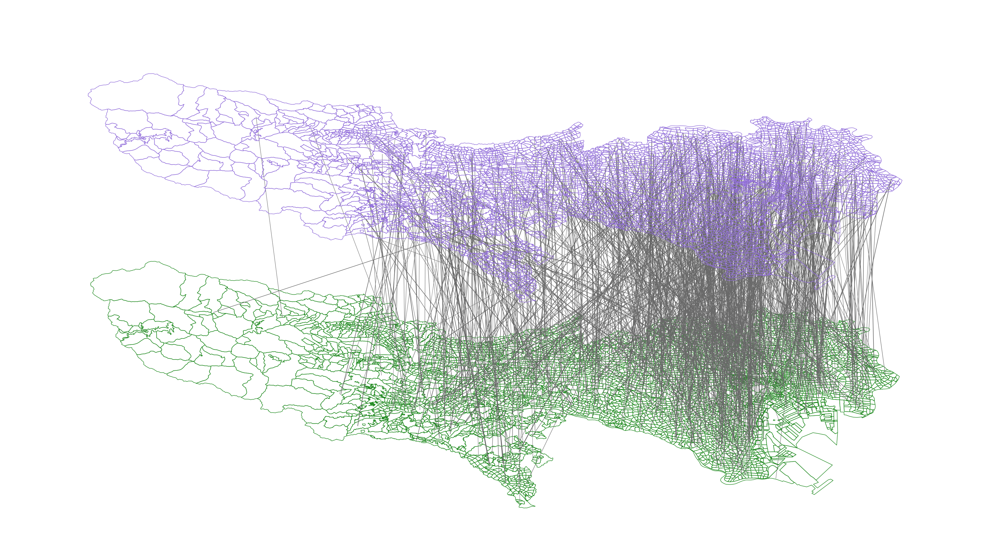
    <div style="background-color: rgba(238, 242, 255, 0.98); padding: 1rem 1.5rem; border-radius: 0 0 12px 12px; box-shadow: 0 8px 24px rgba(0, 0, 0, 0.15); border: 2px solid rgba(99, 102, 241, 0.3); border-top: none;">
      <h3 style="color: #4338ca; margin: 0; font-size: 1.2rem; font-weight: 600; text-align: center;">基于GPS大数据的移动网络构建和解析</h3>
    </div>
  </div>
</div>

<div v-if="showImage2" @click="toggleImage2" style="position: absolute; top: 0; left: 0; right: 0; bottom: 0; cursor: pointer; display: flex; align-items: center; justify-content: center; z-index: 10; background-color: rgba(255, 255, 255, 0.95); padding: 2rem;">
  <div style="display: flex; flex-direction: column; width: 100%; max-width: 900px;">
    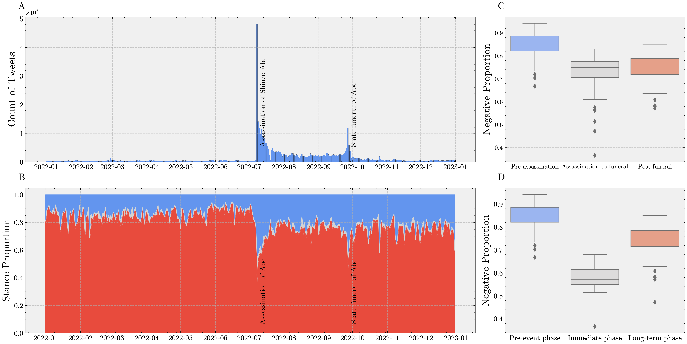
    <div style="background-color: rgba(238, 242, 255, 0.98); padding: 1rem 1.5rem; border-radius: 0 0 12px 12px; box-shadow: 0 8px 24px rgba(0, 0, 0, 0.15); border: 2px solid rgba(99, 102, 241, 0.3); border-top: none;">
      <h3 style="color: #4338ca; margin: 0; font-size: 1.2rem; font-weight: 600; text-align: center;">基于社交媒体数据和文本分析地网络空间意见形成的动态解析</h3>
    </div>
  </div>
</div>

<div v-if="showImage3" @click="toggleImage3" style="position: absolute; top: 0; left: 0; right: 0; bottom: 0; cursor: pointer; display: flex; align-items: center; justify-content: center; z-index: 10; background-color: rgba(255, 255, 255, 0.95); padding: 2rem;">
  <div style="display: flex; flex-direction: column; max-width: 60%; max-height: 55vh;">
    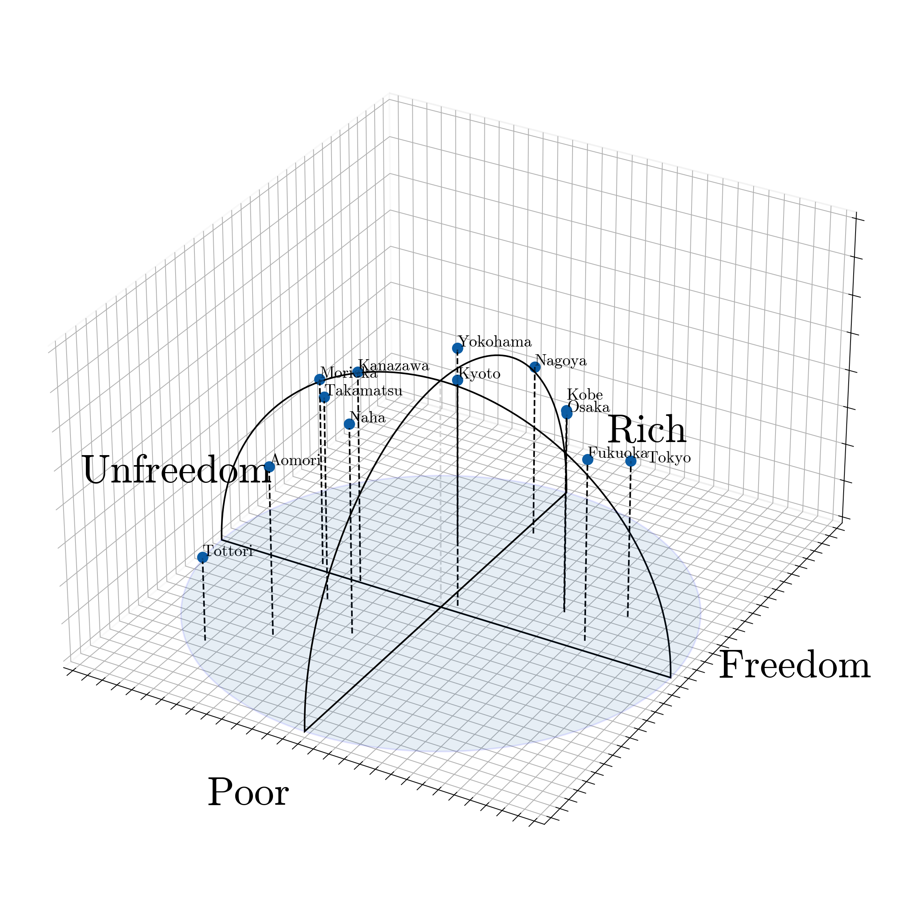
    <div style="background-color: rgba(238, 242, 255, 0.98); padding: 1rem 1.5rem; border-radius: 0 0 12px 12px; box-shadow: 0 8px 24px rgba(0, 0, 0, 0.15); border: 2px solid rgba(99, 102, 241, 0.3); border-top: none; flex-shrink: 0;">
      <h3 style="color: #4338ca; margin: 0; font-size: 1.2rem; font-weight: 600; text-align: center;">基于词向量的语义解构</h3>
    </div>
  </div>
</div>

</div>


---
layout: top-title
color: indigo-light
align: lt
---
:: title ::

# 内容概要

:: content ::

<v-clicks depth="2">

## 自然语言处理核心技术的理解
- 词向量(Word Embedding)
- (大)语言模型 (Language Model)

## 自然语言处理在社会科学中的应用
- 基于词向量的语义解构方法
- 基于大语言模型的社会模拟

</v-clicks>
 
---
layout: section
color: indigo-light
---


# `自然语言处理`的核心理解 

<hr>

自然语言处理技术的发展脉络及对于其核心技术「词向量」的直观理解

---
layout: top-title
color: indigo-light
align: lt
---
:: title ::

# 自然语言处理的发展历史

:: content ::


- 自然语言处理（NLP: Natural Language Processing）是一系列让计算机处理人类日常使用的自然语言的技术
    - 对于计算机而言，处理像人类语言这样缺乏明确规则的非结构化数据往往是十分困难的任务


<div v-click style="position: absolute; top: 280px; left: 280px; right: 530px; height: 200px; background-color: rgba(99, 102, 241, 0.1); border-radius: 8px; z-index: 0; display: flex; align-items: center; justify-content: center; padding: 1rem;">
  <div style="background-color: #4338ca; padding: 0.5rem 1rem; border-radius: 6px;">
    <p style="color: white; font-weight: 600; font-size: 1.1rem; margin: 0; text-align: center;">统计机器学习方法</p>
  </div>
</div>


<div v-after style="position: absolute; top: 280px; left: 450px; right: 100px; height: 200px; background-color: rgba(99, 102, 241, 0.1); border-radius: 8px; z-index: 0; display: flex; align-items: center; justify-content: center; padding: 1rem;">
  <div style="background-color: #4338ca; padding: 0.5rem 1rem; border-radius: 6px;">
    <p style="color: white; font-weight: 600; font-size: 1.1rem; margin: 0; text-align: center;">深度学习在NLP的广泛应用</p>
  </div>
</div>

<Arrow v-click x1="490" y1="260" x2="490" y2="300" />

<Arrow v-after x1="710" y1="470" x2="710" y2="420" />


<div style="display: flex; justify-content: center;">
  
</div>


---
layout: side-title
side: l
color: indigo-light
titlewidth: is-3
align: lm-lt
title: Side Title Layout (Another)
---

:: title ::

# 自然语言处理的基础课题

- 如何用向量(数值数组)来表现文本

# <mdi-arrow-right />

:: content ::

<v-clicks depth="2">

- **计算机只能处理数值形式的数据**
  - 几乎所有机器学习与深度学习算法也都要求输入为向量或矩阵

- 以将文本的更小单位（如词语）表示为向量作为出发点
    - **词向量**: 将每个词映射为一个固定维度的实数向量
    - 可以在后续处理中将每个词的向量表示组合成整个文本的表示
</v-clicks>

<div v-click style="text-align: center;">
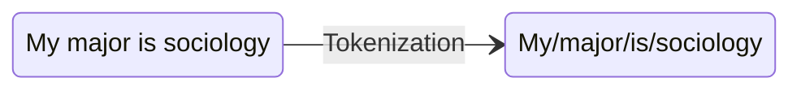
</div>

<div v-after style="text-align: center;">


</div>

<div v-click>
<Admonition title="对于词向量的基本要求" color="indigo" custom="text-lg" customTitle="text-red-500">

   - 词与词向量之间的映射关系
   - 词向量捕捉和表达词语的语义信息

</Admonition>
</div>


---
layout: top-title
color: indigo-light
align: lt
---
:: title ::

# One-hot Encoding

:: content ::

<v-clicks depth="2">

- 假设我们有以下英文句子："I like NLP and AI"
- ==为文本中的每个独立词构建一个词汇表，并为每个词分配一个唯一的索引==
- 该向量只有一个位置为 1（对应该词的索引），其余为 0

| 词语   | One-hot Encoding        |
|--------|------------------------|
| I      | [1, 0, 0, 0, 0]        |
| like   | [0, 1, 0, 0, 0]        |
| NLP    | [0, 0, 1, 0, 0]        |
| and    | [0, 0, 0, 1, 0]        |
| AI     | [0, 0, 0, 0, 1]        |

</v-clicks>


---
layout: side-title
side: l
color: indigo-light
titlewidth: is-4
align: lm-lt
title: Side Title Layout (Another)
---

:: title ::

# One-hot Encoding的问题

<v-clicks depth="2">

- 算法上的缺陷
    - 高维稀疏
    - 学习效率低
    - ...
- 无法反映语义关系
    - 向量之间的距离或夹角==应当可以==反映词语间的语义相似程度或者联系
    - 词之间的语义关系==应当可以==通过向量运算表达

</v-clicks>

:: content ::


<div style="display: flex; justify-content: center; align-items: center; height: 120%; padding-top: 6rem;">
  
</div>


---
layout: top-title
color: indigo-light
align: lt
---
:: title ::

# 词向量的语义表达

:: content ::


<div style="display: flex; justify-content: center;">
  
</div>


---
layout: iframe
url: https://www.cs.cmu.edu/~dst/WordEmbeddingDemo/
---


---
layout: top-title
color: indigo-light
align: lt
---

:: title ::

# Word Embedding训练的基本原理: 分布假说

:: content ::

> "You shall know a word by the company it keeps（你可以通过其周围的上下文单词来了解一个目标单词）"

<div style="position: relative; height: 400px;">
  <div v-click="1" style="position: absolute; top: 0; left: 50%; transform: translateX(-50%); width: 800px;">
    
  </div>

  <div v-click="2" style="position: absolute; top: 0; left: 50%; transform: translateX(-50%); width: 800px;">
    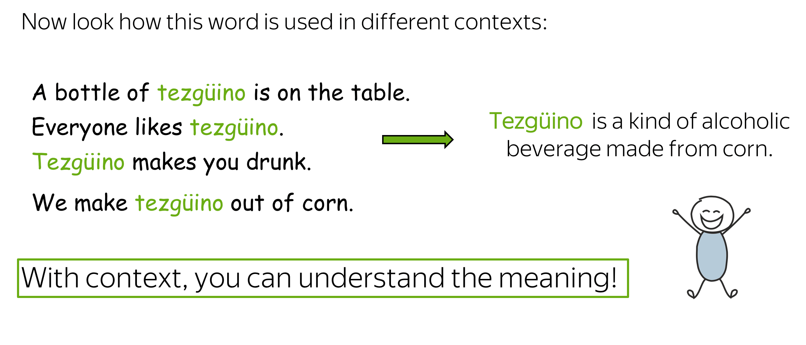
  </div>

  <div v-click="3" style="position: absolute; top: 0; left: 50%; transform: translateX(-50%); width: 800px;">
    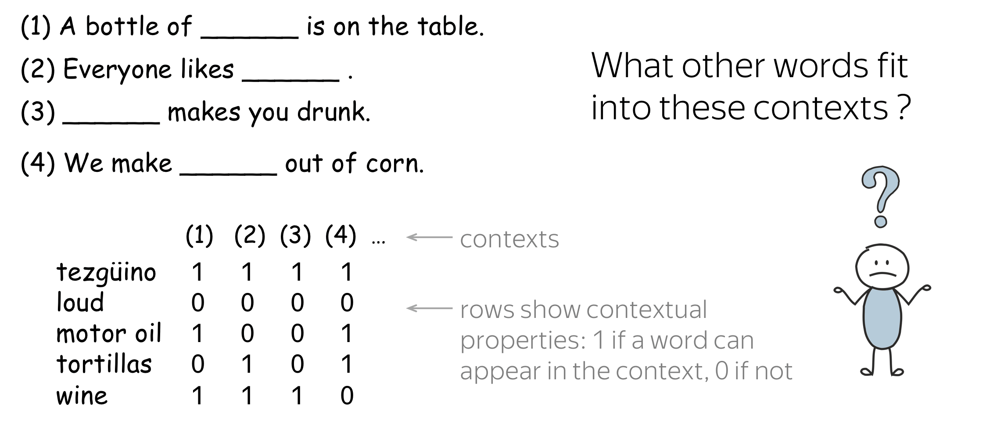
  </div>

  <div v-click="4" style="position: absolute; top: 0; left: 50%; transform: translateX(-50%); width: 800px;">
    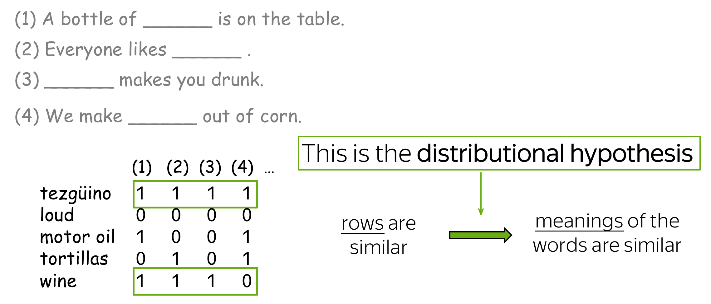
  </div>
</div>


---
layout: top-title
color: indigo-light
align: lt
---

:: title ::

# Word Embedding训练方法

:: content ::

<div class="grid grid-cols-2 gap-4">
  <div v-click="1">
    
  </div>
  <div v-click="3">
    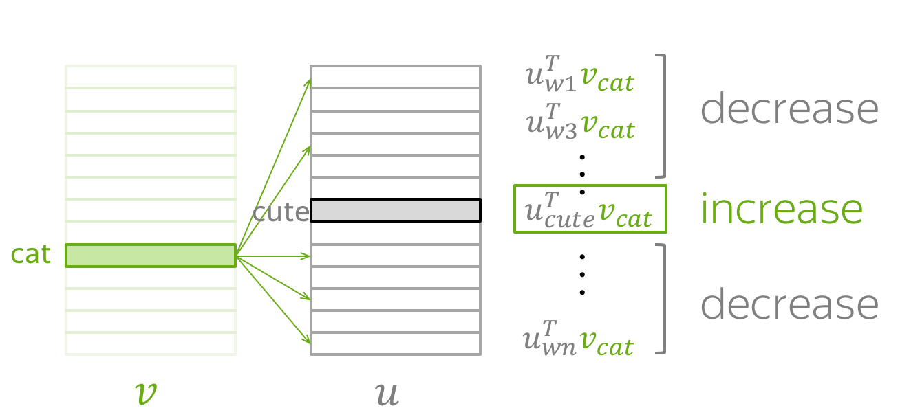
  </div>
  <div v-click="2">
    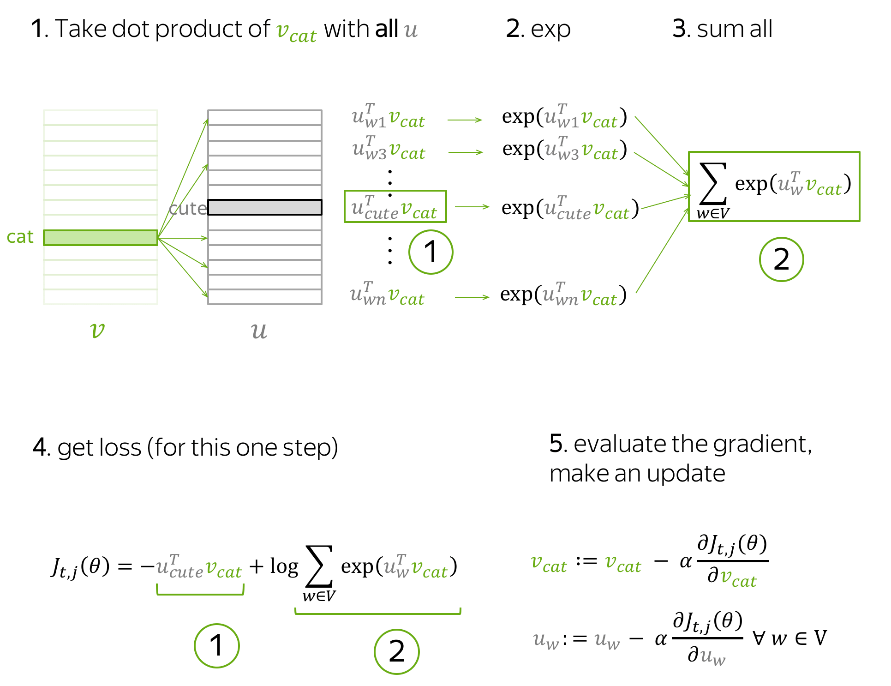
  </div>
  <div v-click="4" style="display: flex; justify-content: center; align-items: flex-start;">
    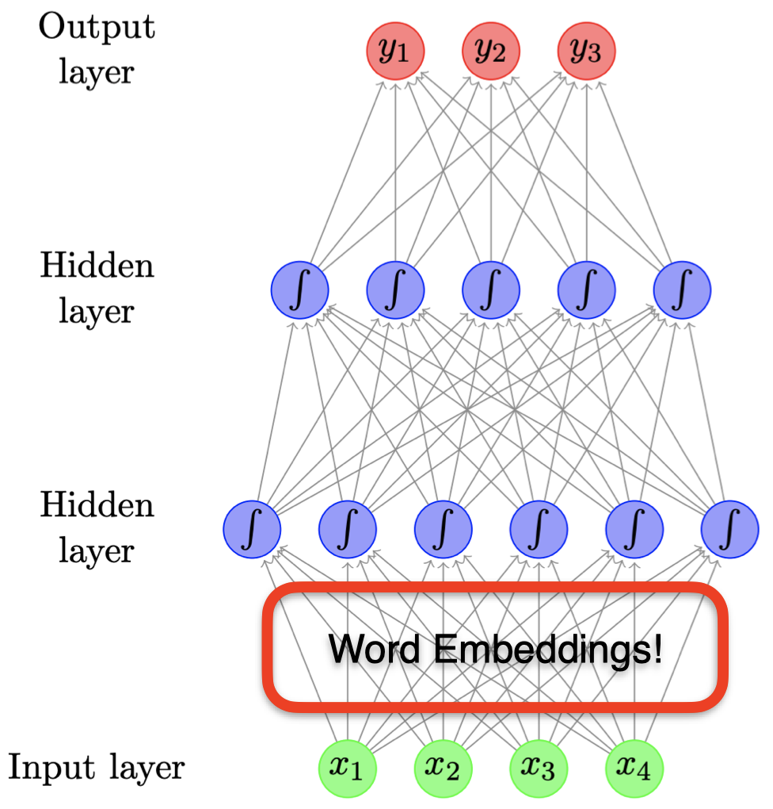
  </div>

</div>


---
layout: top-title
color: indigo-light
align: lt
---

:: title ::

# Word Embedding的操作: Gensim

:: content ::


- [Gensim](https://radimrehurek.com/gensim/)是一个开源的关于自然语言处理的Python库
    - 提供了高效的关于词向量操作的各种实现


````md magic-move {lines: true}


```ts {1|2|*}
# 使用Gensim进行词向量的学习
from gensim.models import Word2Vec

model = Word2Vec(
    sentences=processed_corpus,  # 用于训练的语料库
    vector_size=100,             # 词向量的维度
    window=5,                    # 上下文窗口大小
    min_count=5,                 # 忽略出现频率小于5的单词
    sg=1,                        # 1表示使用skip-gram（0表示CBOW）
    negative=5                   # 负采样的样本数量
)

```

```ts {1|2-3|*}
#使用Gensim进行词向量的操作
model.similarity('woman', 'man')
> 0.7664013
result = model['king'] - model['man'] + model['woman']
similar_words = model.most_similar([result], topn=10)
for word, similarity in similar_words:
    print(f'{word}: {similarity}')

> queen: 0.730051577091217
  monarch: 0.6454662084579468
  princess: 0.6156250834465027
  crown_prince: 0.5818676948547363
  prince: 0.5777117013931274
  kings: 0.561366617679596
  sultan: 0.5376775860786438
  Queen_Consort: 0.5344247221946716
  queens: 0.5289887189865112
```
````


---
layout: section
color: indigo-light
---


# `词向量`在社会科学中的应用

<hr>

以语义解析为例说明词向量在社会科学中的应用


---
layout: top-title
color: indigo-light
align: lt
---

:: title ::

# Word2Vec在社会科学中的应用

:: content ::

<v-clicks depth="3">

- 利用Word2Vec进行文本分析
   - 作为一种将词语转换为向量表示的技术,可以捕捉和表示文本的语义辅助多种自然语言处理任务
       - 文本分类
       - 文本聚类

- ==利用word2vec的训练原理捕捉语义的变迁==
    - **语义随着社会发展而变化,反映了社会意识形态、权力结构和文化焦点的转移**
       - 语义定义的内在复杂性
       - 长期间跨度的系统性分析存在困难
    - **利用Word2vec捕捉语义变迁的可能性**
       - Word2vec可以实现对于语义的定量化表达,实现不同时期的系统性分析
       - Word2vec的词向量表达依赖于训练语料库, 反映语料库中呈现的词语共现模式和语义关系
           - 不同时代的语料库可以反映相应时代背景下下特定概念的语义特质
</v-clicks>
 

---
layout: top-title
color: indigo-light
align: lt
---

:: title ::

# 基于Word2Vec的语义变迁分析 [(Garg et al., 2018)](https://www.pnas.org/doi/10.1073/pnas.1720347115)


:: content ::


- **研究概要**: 利用词向量量化分析了过去一百年美国社会中性别和种族刻板印象的演变
- **数据**:针对特定时间段训练独立的词向量模型(基于Google Books)


<div style="text-align: center; margin-top: 1rem;">
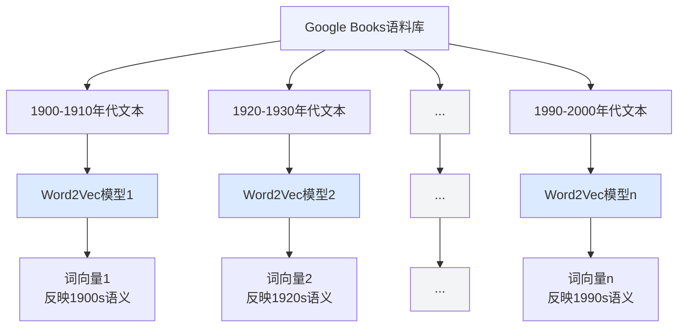
</div>

<div style="background-color: #dce2fa; padding: 1rem 1.5rem; margin-top: 1.5rem; border-radius: 0 8px 8px 0;">
  <p style="color: #6366f1; font-weight: 600; margin: 0; text-align: center;">词向量可以反映相应时期的语义理解</p>
</div>


---
layout: top-title
color: indigo-light
align: lt
---

:: title ::

# 基于Word2Vec的语义计算

:: content ::

<v-clicks depth="2">

- $\text{Relative Norm Distance} = \sum_{v_m \in M} ( |v_m - v_1|_2 - |v_m - v_2|_2)$
    - $M$: 参照对象词语（例如职业名称或形容词）的向量集合
    - $v_m$: 集合$M$中每个参照对象词语的词向量
    - $v_1$: 第一个群体（例如男性）的代表性向量，通过取该群体中若干代表性词语（例如代词或姓氏）的向量的平均值得到
    - $v_2$: 第二个群体（例如女性）的代表性向量，同样通过取该群体中若干代表性词语的向量的平均值得到
    - $|u-v|_2$: 向量$u$和$v$之间的欧几里得距离的平方
- 指标含义
    - 负值表示参照对象词语更倾向于与第一个群体相关联
    - 正值表示参照对象词语更倾向于与第二个群体相关联
    - ==绝对值表示与其中一个群体的关联性程度==
</v-clicks>


---
layout: top-title-two-cols
color: indigo-light
align: l-lb-lb
---
::title::

# 基于Word2Vec关于性别偏见的分析

:: left ::

<div style="display: flex; justify-content: center; margin-top: 3rem;">
  
</div>

<div style="margin-top: 1.5rem;">

- 比较词向量和外部数据(职业的性别比例)中反映的偏见趋势

</div>

:: right ::

<div style="display: flex; justify-content: center; margin-top: 3rem;">
  
</div>

<div style="margin-top: 1.5rem;">

- 比较词向量和外部数据(职业的性别比例差距)中反映的偏见趋势变化

</div>


---
layout: top-title
color: indigo-light
align: lt
---

:: title ::

# 基于Word2Vec的概念解构分析 [(Kozlowski et al., 2019)](https://journals.sagepub.com/doi/full/10.1177/0003122419877135)


:: content ::

<v-clicks depth="3">

- **社会阶层(Class)的文化维度及其演变**
    - ==社会阶层是一个复杂且多维度的概念==: 包含财富、教育、职业、地位等多方面等因素
        - 词向量技术将词语嵌入到一个高维的向量空间中, 在这个空间中，每个维度都可能蕴含着一定的"文化"意义
    - ==不同阶层维度之间关系的动态变化==
        - 基于不同历史时期的语料训练的词向量模型可以反映随时间演变的动态变化

- [Kozlowski, Taddy, & Evans (2019)](https://journals.sagepub.com/doi/full/10.1177/0003122419877135)详细阐述了如何利用词向量技术实现针对复杂概念的解构
    - 利用词向量的计算构建理解特定复杂概念的维度
    - 利用词向量的计算理解概念与维度之间的关系
    - 利用词向量的计算理解不同维度之间的关系
    - 利用词向量的计算理解维度语义的演变

</v-clicks>


---
layout: side-title
side: l
color: indigo-light
titlewidth: is-5
align: lm-lm
title: Side Title Layout (Another)
---

:: title ::

# 利用词向量的计算构建理解特定复杂概念的维度

<v-clicks depth="3">


- **构建维度**: 计算一组具有相反语义的词语集合之间词向量差的平均值
    - 构建“*富裕*”维度: 计算 $rich - poor$，$priceless - worthless$等词对的向量差的平均值
- **词语在文化维度上的投影**: 通过计算其他词语的向量在这个维度向量上的正交投影（即余弦相似度），来确定该词语与该文化维度的关联程度
    - 某个词语的向量与文化维度向量之间的夹角越小, 说明它们之间的关系越紧密(余弦相似度越高)

</v-clicks>


:: content ::

<div style="display: flex; justify-content: center;">
  
</div>


---
layout: side-title
side: l
color: indigo-light
titlewidth: is-4
align: lm-lm
title: Side Title Layout (Another)
---

:: title ::

# 利用词向量的计算维度关系演变

<v-clicks depth="3">

- **不同维度之间的关系**: 通过计算不同文化维度向量之间的角度（余弦相似度），可以了解这些维度在文化意义上的关联性和独立性
    - 如果两个维度的向量之间的角度接近90度，则表明它们在语义概念上相对独立
- 基于在不同时期语料库上训练的词向量模型可以帮助理解维度关系的演变

</v-clicks>

:: content ::

<div style="display: flex; justify-content: center;">
  
</div>

- 「富裕」维度在二十世纪初与「文化修养」和「地位」维度最为接近
- 「富裕」维度与「教育」维度之间的关联性在逐渐增加

---
layout: side-title
side: l
color: indigo-light
titlewidth: is-5
align: lm-lm
title: Side Title Layout (Another)
---

:: title ::

# 利用词向量的计算概念稳定性的演变

<v-clicks depth="3">

- 计算维度向量在每个十年的词语投影与之后每个十年的词语投影之间的相关性
- 社会阶层的基本维度结构是稳定的，但构成这些维度的具体词语的文化意义和相对位置也在不断演变
    - 1900 年代被认为是「富裕」的词语，与 1990 年代被认为是「富裕」的词语，其相对排序仍然有很高的相关性
    - 不同维度下降速度的差异表现了语义稳定性的差异

</v-clicks>

:: content ::

<div style="display: flex; justify-content: center;">
  
</div>


---
layout: top-title
color: indigo-light
align: lt
---

:: title ::

# 相关应用:Historical Representations of Well-being

:: content ::


**研究关心:** 利用词向量模型理解「Well-being」的概念结构及其演变

<v-clicks depth="4">

- 「Well-being」是一个复杂且多维度的概念
    - Hedonic Well-being(享乐式幸福):以快乐和痛苦的减少为核心目标，强调短期的满足和愉悦
    - Eudaimonic Well-being: 关注 自我实现、个人成长、目标感、意义感，认为幸福不仅仅是快乐，而是实现人的潜力和内在价值
- 不同时期和社会背景下人们对于Well-being认知侧重的变化

**数据和方法**

- 使用[日本国会图书馆](https://lab.ndl.go.jp/ngramviewer/)提供的包含1910 年代至 1980 年代期间出版的杂志、书籍和官方公报的语料库
- 按照年份进行切分为每个时间段训练相应的词向量模型

</v-clicks>

---
layout: top-title
color: indigo-light
align: lt
---

:: title ::

# 语义空间的构建

:: content ::

<div class="grid grid-cols-2 gap-8">
  <div style="display: flex; justify-content: center;">
    
  </div>

  <div style="display: flex; justify-content: center;">
    
  </div>
</div>


---
layout: top-title
color: indigo-light
align: lt
---

:: title ::

# Well-being相关维度的稳定性变化

:: content ::

<div style="display: flex; justify-content: center;">
  
</div>

---
layout: top-title
color: indigo-light
align: lt
---

:: title ::

# Well-being的解构及演变

:: content ::

<div style="display: flex; justify-content: center;">
  
</div>


---
layout: top-title
color: indigo-light
align: lt
---

:: title ::

# 小结:词向量在社会科学中的应用可能性及注意点

:: content ::

<v-clicks depth="4">

- 词向量技术为社会科学研究提供了一种强大的工具，可以帮助研究者捕捉和量化文本数据中的复杂语义信息
    - 词向量作为一种灵活的文本表示方法，可以和多种向量计算分析框架相结合([Arseniev-Koehler et al., (2022)](https://journals.sagepub.com/doi/10.1177/00491241221122603); [Grand et al., (2022)](https://www.nature.com/articles/s41562-022-01316-8); [Hiroaki et al., 2023](https://aclanthology.org/2023.emnlp-main.283/))
    - 多样化的语料库和向量分析方法扩宽了社会科学实证分析的广度和时间跨度

- 词向量在社会科学上的应用需要建立在对于词向量技术的正确理解之上
   - 词向量模型的训练结果高度依赖于所使用的语料库
   - 词向量模型的参数选择和训练方法会显著影响其表示能力, 需要谨慎选择和调整
       - 必要时采取人类评估
   - Context Space 与 Concept Space 之间的区别[(Boutyline & Arseniev-Koehler, 2025)](https://www.annualreviews.org/content/journals/10.1146/annurev-soc-090324-024027): 词向量捕捉的是词语在特定语料库中的共现模式, 而非词语的本质含义　

</v-clicks>

---
layout: section
color: indigo-light
---

# `大语言模型`的核心原理

<hr>

大语言模型的核心概念理解

---
layout: top-title-two-cols
columns: is-6
align: l-lt-lt
color: indigo-light
---

:: title ::

# 大语言模型的基本概念


:: left ::

<div style="display: flex; justify-content: center;">
  
</div>

<div style="display: flex; justify-content: center;">
  
</div>


:: right ::

<v-click>

**自回归语言模型**: 从前到后逐步预测下一个词的方式生成文本的模型


<div style="display: flex; justify-content: center;">
  
</div>

</v-click>

<v-click>

<Admonition title="建立大语言模型的瓶颈" color="indigo-light" custom="text-lg font-bold" customTitle="text-red-500">
有效率地训练大规模的语言模型并不容易
</Admonition>

</v-click>


---
layout: top-title-two-cols
columns: is-6
align: l-lt-lt
color: indigo-light
---


:: title ::

# 大语言模型的核心架构:Transformer [(Vaswani et al., 2017)](https://dl.acm.org/doi/10.5555/3295222.3295349)


:: left ::

<script setup>
import { ref } from 'vue'
const showSeq2SeqImage = ref(false)
const showAttentionImage = ref(false)
const toggleSeq2SeqImage = () => {
  showSeq2SeqImage.value = !showSeq2SeqImage.value
}
const toggleAttentionImage = () => {
  showAttentionImage.value = !showAttentionImage.value
}
</script>

<div style="position: relative;">

<div :style="{ opacity: (showSeq2SeqImage || showAttentionImage) ? 0.1 : 1, transition: 'opacity 0.3s' }">

- Transformer 是基于==Attention==机制的==Seq2Seq==架构 
- Seq2Seq <a @click="toggleSeq2SeqImage" class="ns-c-iconlink" style="cursor: pointer;"><mdi-graph /></a>
    - 编码器(Encoder): 接收输入序列(文字)，将其编码成一个固定长度的向量
    - 解码器(Decoder): 从编码器生成的表示出发，生成输出序列中的每个词。
- Attention <a @click="toggleAttentionImage" class="ns-c-iconlink" style="cursor: pointer;"><mdi-graph /></a>
    - 模型在处理输入的每个词时，考虑整个输入序列中其他所有词的影响
    - 允许序列中所有元素同时处理，因此可以高效并行化计算

</div>

<div v-if="showSeq2SeqImage" @click="toggleSeq2SeqImage" style="position: absolute; top: 0; left: 0; right: 0; bottom: 0; cursor: pointer; display: flex; align-items: center; justify-content: center; z-index: 10; background-color: rgba(255, 255, 255, 0.95); padding: 2rem;">
  <div style="display: flex; flex-direction: column; max-width: 95%; max-height: 70vh;">
    
    <div style="background-color: rgba(238, 242, 255, 0.98); padding: 1rem 1.5rem; border-radius: 0 0 12px 12px; box-shadow: 0 8px 24px rgba(0, 0, 0, 0.15); border: 2px solid rgba(99, 102, 241, 0.3); border-top: none; flex-shrink: 0;">
      <h3 style="color: #4338ca; margin: 0; font-size: 1.2rem; font-weight: 600; text-align: center;">Seq2Seq架构示意图</h3>
    </div>
  </div>
</div>

<div v-if="showAttentionImage" @click="toggleAttentionImage" style="position: absolute; top: 0; left: 0; right: 0; bottom: 0; cursor: pointer; display: flex; align-items: center; justify-content: center; z-index: 10; background-color: rgba(255, 255, 255, 0.95); padding: 2rem;">
  <div style="display: flex; flex-direction: column; max-width: 90%; max-height: 70vh;">
    <video autoplay loop muted style="max-width: 100%; max-height: 65vh; width: auto; height: auto; object-fit: contain; border-radius: 8px 8px 0 0; box-shadow: 0 8px 16px rgba(0, 0, 0, 0.2); display: block; margin: 0 auto;">
      <source src="./Figure/encoder_self_attention.mp4" type="video/mp4">
    </video>
    <div style="background-color: rgba(238, 242, 255, 0.98); padding: 1rem 1.5rem; border-radius: 0 0 12px 12px; box-shadow: 0 8px 24px rgba(0, 0, 0, 0.15); border: 2px solid rgba(99, 102, 241, 0.3); border-top: none; flex-shrink: 0;">
      <h3 style="color: #4338ca; margin: 0; font-size: 1.2rem; font-weight: 600; text-align: center;">Attention机制</h3>
    </div>
  </div>
</div>

</div>

:: right ::

<div style="display: flex; justify-content: center;">
  
</div>

<div v-click="1" style="position: absolute; top: 260px; left: 560px; right: 280px; height: 160px; background-color: rgba(99, 102, 241, 0.5); border-radius: 8px; z-index: 0; display: flex; align-items: center; justify-content: center; padding: 1rem;">
  <div style="background-color: #4338ca; padding: 0.5rem 1rem; border-radius: 6px;">
    <p style="color: white; font-weight: 600; font-size: 1.1rem; margin: 0; text-align: center;">Encoder</p>
  </div>
</div>


<div v-click="1" style="position: absolute; top: 120px; left: 700px; right: 140px; height: 310px; background-color: rgba(184, 241, 99, 0.5); border-radius: 8px; z-index: 0; display: flex; align-items: center; justify-content: center; padding: 1rem;">
  <div style="background-color: #506720ff; padding: 0.5rem 1rem; border-radius: 6px;">
    <p style="color: white; font-weight: 600; font-size: 1.1rem; margin: 0; text-align: center;">Decoder</p>
  </div>
</div>


---
layout: section
color: indigo-light
---


# 大语言模型与社会科学
<hr>

大语言模型的发展带来的社会科学研究中的新机遇和方向

---
layout: top-title
color: indigo-light
align: lt
---

:: title ::

# 大语言模型作为文本分析的工具

:: content ::

> “几乎所有 NLP 任务”都能转化为文本生成 [(Brown et al., 2020)](https://arxiv.org/abs/2005.14165)


| 任务     | 输入示例                              | 输出示例                         | 生成式转化形式（Prompt）                     |
|--------------|---------------------------------------|----------------------------------|-----------------------------------------------|
| 文本分类     | 一段文本：This movie is fantastic.    | Positive                         | Text: This movie is fantastic. Sentiment: ___ |
| 问答         | 问题：Who wrote Hamlet?               | William Shakespeare              | Q: Who wrote Hamlet? A: ___                    |
| 翻译         | 英文句子：How are you?                | 法文：Comment ça va ?            | Translate English to French: How are you? ___ |
| 摘要         | 文章：Artificial intelligence...      | 简要：AI is a branch of CS...    | Summarize the following: Artificial... ___    |


---
layout: top-title-two-cols
color: indigo-light
align: l-lt-lb
---

:: title ::

# 大语言模型智能体 (LLMs Agent)

:: left ::

🤖 Agent: 能够感知环境、做出决策并采取行动的实体

- LLMs Agent: 以大语言模型为核心进行推理、决策和行动的智能体


⭐️ LLM Agent为社会科学研究带来的新机遇和方向

- LLM-based Agent作为社会模拟的新框架

- LLM Agent 与人类互动带来的Human–Machine社会中的新课题

:: right ::

<div style="display: flex; justify-content: center;">
  
</div>


---
layout: top-title
color: indigo-light
align: lt
---
:: title ::

# 社会模拟: 社会事实状况的再现(?)

:: content ::

<div style="display: flex; justify-content: center;">
  
</div>

---
layout: top-title
color: indigo-light
align: lt
---

:: title ::

# 社会科学中的社会模拟方法:Macro-Micro Link

:: content ::

<div style="display: flex; justify-content: center;">
  
</div>


- 宏观层面的制度、规则、文化、社会结构会影响个体行为
- 个体之间的互动会产生一些集体行为
- 大量个体行为聚合后，形成新的宏观社会现象（bottom-up emergence）

---
layout: iframe-right
title: iframe Right Layout
# the web page source
url: http://nifty.stanford.edu/2014/mccown-schelling-model-segregation/

# a custom class name to the content
class: my-cool-content-on-the-right
slide_info: false
---

# 社会科学中的社会模拟方法: Agent based Model

- **社会模拟的核心思想**: Agent按照局部规则独立行动，最后产生宏观社会结构
- 环境(Environment)设置
    - 以一个二维网格表示居住空间
- Agent=居民: 不同人种的居民
    - 每个居民都会==观察==邻域中同类居民的比例
    - 若比例低于其==容忍度==,居民就就会选择移动位置

<AdmonitionType type="important" width="300px">
Agent 的特征和行为通过数学形式化来定义
</AdmonitionType>


---
layout: top-title
color: indigo-light
align: lt
---

:: title ::

# 社会模拟的目标

:: content ::

<script setup>
import { ref } from 'vue'
const showFrameworkImage = ref(false)
const toggleFrameworkImage = () => {
  showFrameworkImage.value = !showFrameworkImage.value
}
</script>

<div style="position: relative;">

<div :style="{ opacity: showFrameworkImage ? 0.1 : 1, transition: 'opacity 0.3s' }">

<v-clicks depth="4">

- 社会模拟的不同方向性
  - **预测性模拟**: 通过建立尽可能再现事实状况的模拟来预测社会现象的未来发展趋势
      - 例如: 灾难发生时人口的疏散路径预测
  - **解释性模拟**: 通过模拟来理解和解释社会现象的成因和机制
      - 例如: Schelling模型解释了即使个体具有较低的偏好,也会导致高度隔离的社会结构

- 计算社会科学的目标: solution-oriented[(Watts, 2017)](https://www.nature.com/articles/s41599-023-01577-2?fromPaywallRec=false); 解释与预测的结合 [(Hofman et al., 2021)](https://www.nature.com/articles/s41586-021-03659-0)


<div style="display: flex; justify-content: center;">
  
</div>

</v-clicks>

</div>

<div v-if="showFrameworkImage" @click="toggleFrameworkImage" style="position: absolute; top: 0; left: 0; right: 0; bottom: 0; cursor: pointer; display: flex; align-items: center; justify-content: center; z-index: 10; background-color: rgba(255, 255, 255, 0.95); padding: 2rem;">
  <div style="display: flex; flex-direction: column; max-width: 90%; max-height: 80vh;">
    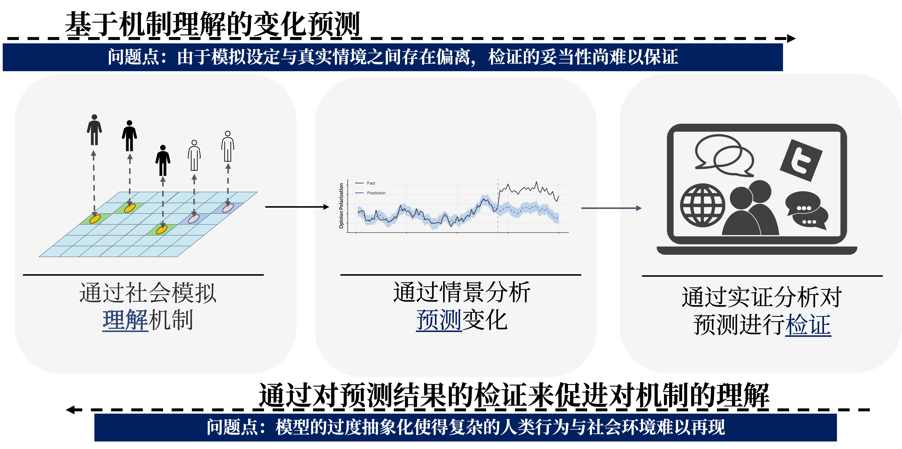
  </div>
</div>

</div>

---
layout: top-title
color: indigo-light
align: lt
---

:: title ::

# 基于LLMs Agent的社会模拟: Generative Agents 

:: content ::

<div grid="~ cols-2 gap-4">
<div>

- ​部署了25个生成式智能体，每个智能体都通过LLMs设置了独特的背景信息、日常计划和行为目标 [(Park et al., 2023)](https://dl.acm.org/doi/fullHtml/10.1145/3586183.3606763)。
    - 记忆（Memory）：​以自然语言形式存储和检索过往经验。​
    - 反思（Reflection）：​对记忆进行整合，形成高层次的洞察，以指导未来行为。​
    - 规划（Planning）：​制定和调整日常计划，响应环境变化。
- 在没有预设的情况下，==智能体之间自发产生了社交行为==

<Admonition title="社会模拟之中" color="indigo-light" custom="text-lg font-bold" customTitle="text-red-500">
Agent的行为和互动通过大语言模型生成的自然语言进行表达
</Admonition>


</div>

<div>

<div style="display: flex; justify-content: center;">
  
</div>

<div style="display: flex; justify-content: center; margin-top: 2rem;">
  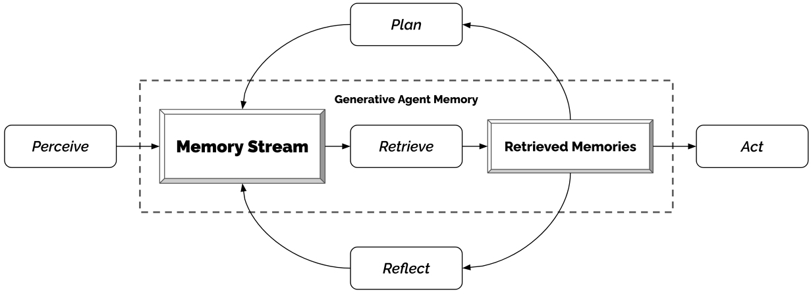
</div>

</div>
</div>


<div class="abs-br m-6 text-xl">
  <a href="https://arxiv.org/abs/2304.03442" target="_blank" class="slidev-icon-btn">
    <carbon:document />
  </a>
</div>


---
layout: top-title
color: indigo-light
align: lt
---

:: title ::

# 基于LLMs Agent社会模拟的机遇

:: content ::

<div class="grid grid-cols-3 gap-4">
  <div style="display: flex; justify-content: center;" v-click="1">
    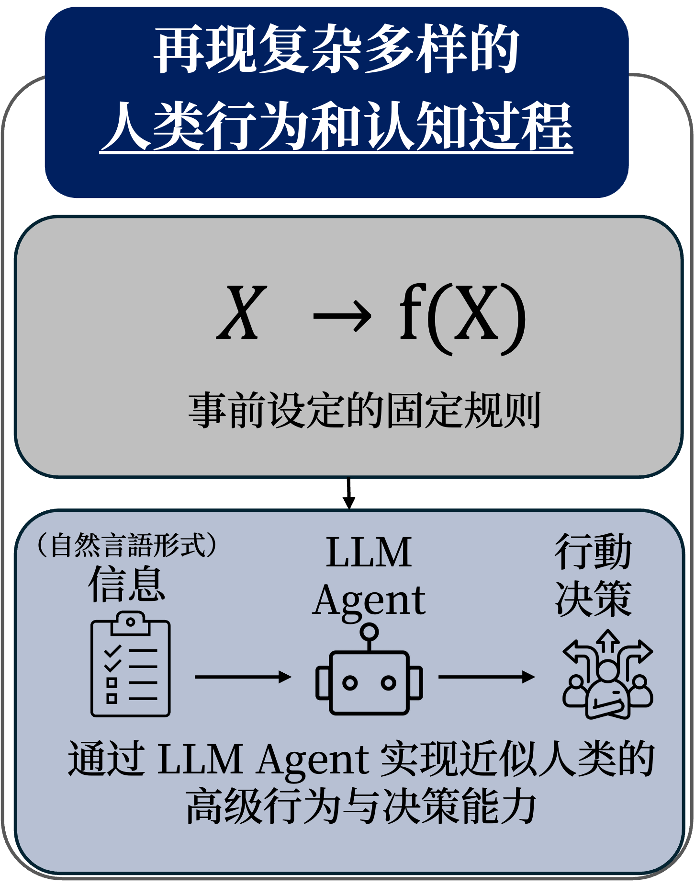
  </div>
  <div style="display: flex; justify-content: center;" v-click="2">
    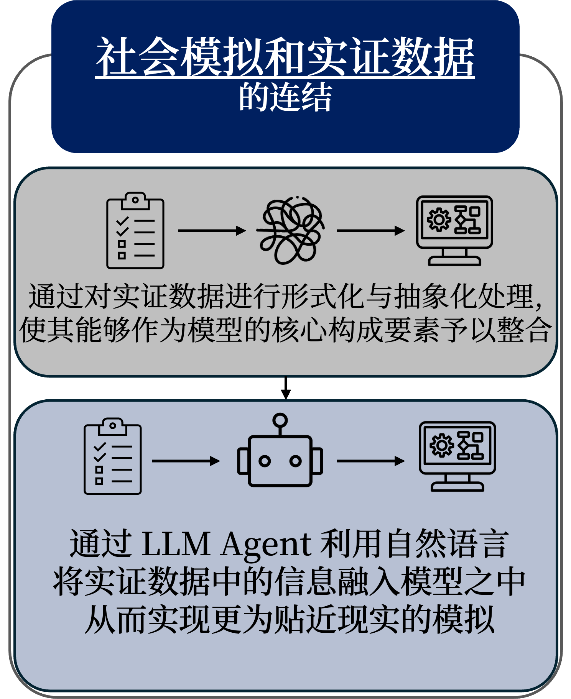
  </div>
  <div style="display: flex; justify-content: center;" v-click="3">
    
  </div>
</div>

<Admonition title="需要注意的是" color="indigo-light" custom="text-lg font-bold" customTitle="text-red-500" v-click="4">
即便是LLMs Agent的社会模拟, 仍然需要谨慎对待其在解释性和预测性方面的局限性
</Admonition>


---
layout: top-title
color: indigo-light
align: lt
---

:: title ::

# 社会科学中基于LLMs Agent社会模拟的挑战

:: content ::

<v-clicks depth="4">

- LLMs 是在统计相关性基础上生成文本，不具备真实的心理结构或动机系统
    - LLM 的行为是“拟人化生成”, 并不意味着它具有同样的认知过程和遵循同样的因果机制

<Admonition title="LLM 可能“模拟出正确的结果”，但可能基于错误的机制" color="indigo-light" custom="text-lg font-bold" customTitle="text-red-500" v-click="3">

- LLM Agent再现了许多人类相关的心理学和社会学现象 ([Dorottya Demszky et al., 2023](https://www.nature.com/articles/s44159-023-00241-5))
    - ❓Agent 内部真的模拟了规范内化・社会认同等心理机制
    - 🤔在训练语料中隐含的特定语言模式
</Admonition>

- 没有真实机制就无法在“反事实场景”中可靠外推
   - LLM的行为本身缺乏透明的因果结构: 内部机制是数十亿参数的复杂非线性映射
   - ==解释与预测的结合，有助于将 LLM 的模拟结果从“黑箱现象”提升为“可检验理论的材料”==

</v-clicks>


---
layout: top-title-two-cols
columns: is-6
align: l-lt-lt
color: indigo-light
---

:: title ::

# LLMs Agent带来新的社会科学课题


:: left ::

- LLM agents逐渐具备以自然语言与人类进行交流、协作与互动的能力
    - 从传统意义上的技术工具转变为==参与社会互动的主体==

- 当前的主流社会学以人类的互动行为为前提  
- ==“人—AI 共在”的情境下重新理解== ➡️
   - *A new sociology of humans and machines* [(Tsvetkova et al., 2024)](https://www.nature.com/articles/s41562-024-02001-8)
   - 人类与LLM agents之间的互动如何塑造社会结构和秩序
   - 人类之间的互动如何受到LLM agents的影响

:: right ::

<div style="display: flex; justify-content: center; margin-top: 2rem;">
  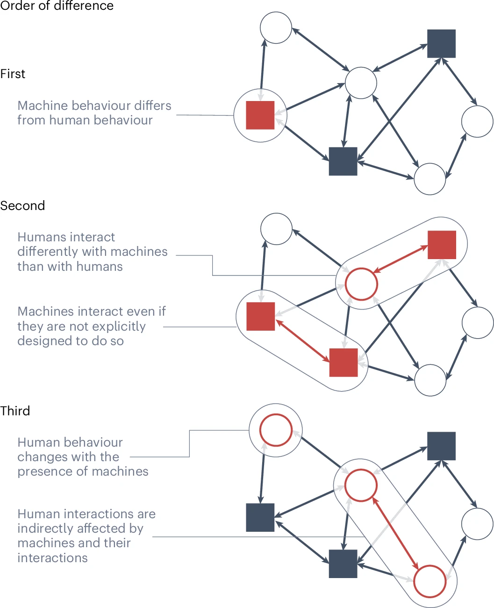
</div>


